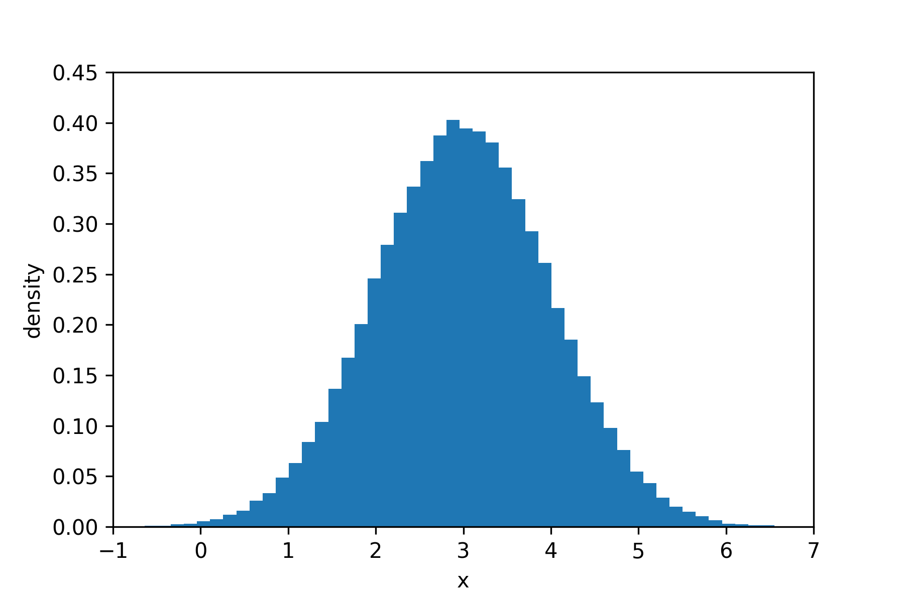
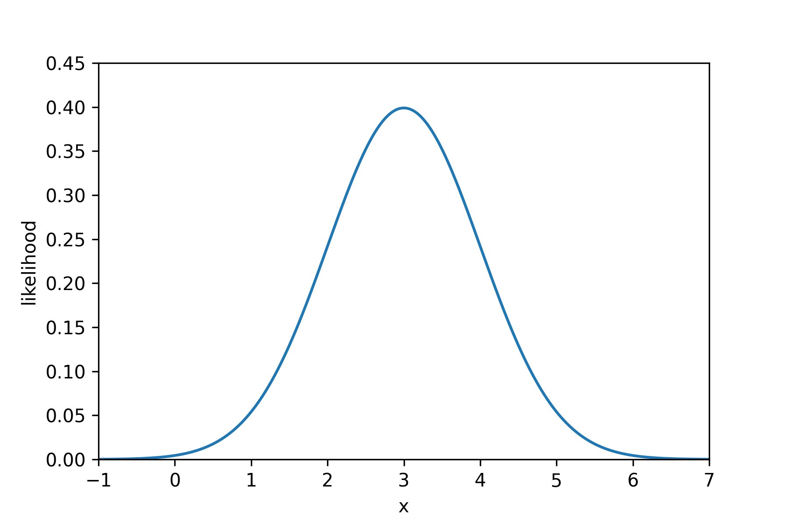
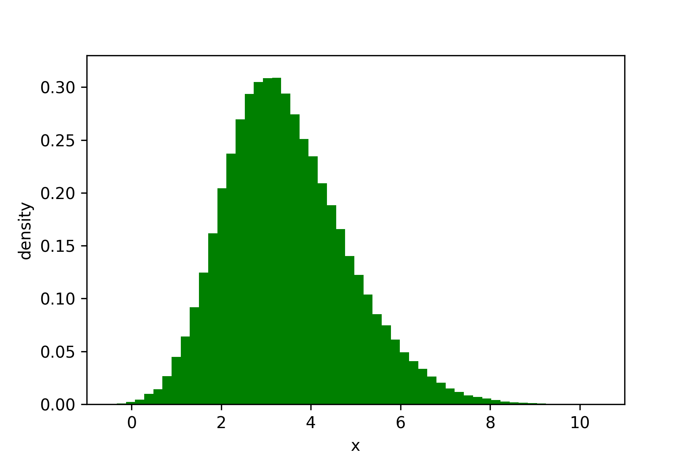
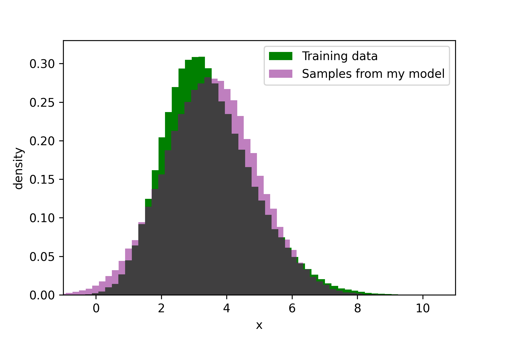
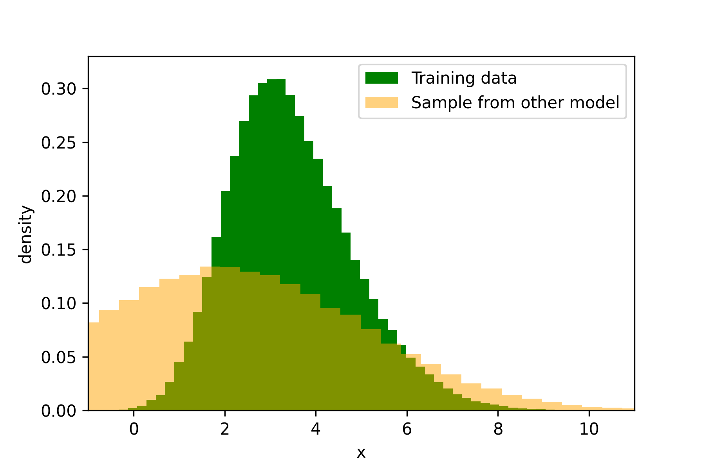

How should we fit models to data? If you look around, some people minimize mean-squared-error. For others, it is the mean-absolute-error which should be reduced. A few may feel inclined towards the Huber loss.

The aim of this article is to convince you that when we want to fit a model to some data, it is sensible to do so by maximizing the likelihood which that model assigns to your data. I want to do this by building the intuition that *the greater the likelihood your model assigns to a dataset, the more likely it is that the dataset could have been generated by your model*.

I've been supervising <a href="https://www.cl.cam.ac.uk/~djw1005/" target="_blank" rel="noopener noreferrer"> Damon Wischik's</a> Data Science course. When I carry out my supervisions, I often have a few key points which I want my students to take away. I plan to write them up here, starting with this.

Before I proceed, we should note that many machine learning practitioners are already convinced that maximizing the likelihood is a natural objective. For example, language models (like ChatGPT), are often trained (at least as an initial step) to predict the next word in a sentence given the past words. This training objective is what comes out when one tries to maximize the likelihood which the language model assigns to the training dataset.

## Intuition 1 ##

**A data point assigned greater likelihood by a model is more likely to be generated by that model.**

Let’s consider a simple probability model, $X \sim N(3,1)$. This means that the random variable, $X$, is distributed according to a Normal distribution with mean 3 and standard deviation 1. We can get a sense of what this means by drawing samples from the model and plotting them on a histogram. This is a Normal distribution, so I expect to see more samples around the value $x=3$.

```python
#here's the code to do this in python
samples = np.random.normal(loc=3,scale=1,size=100000)
plt.hist(samples,bins=60,density=True)
plt.xlabel("x")
plt.ylabel("density")
plt.show()
```
<figure>
    
</figure>


This looks like what we would expect.

Now, this probability model has a likelihood function. I can find this on wikipedia. For this probability model, the likelihood function is $\mathrm{Pr}(x) = \frac{1}{\sqrt{2 \pi}} e^{-\frac{1}{2}(x-3)^2}$. Using this, we can evaluate the likelihood that our model assigns to different values of $x$. Let’s do this and plot a graph of this function.

<figure>
    
</figure>

This graph looks a lot like the histogram we plotted, and that is no coincidence. The $x$ values which are assigned the greatest likelihood, are also the $x$ values which are most likely to be generated by our model.

## Intuition 2 ##

**A *dataset* assigned greater likelihood by a model is more likely to be generated by that model.**

Imagine we have a dataset of x values, $[x_1,x_2,x_3,x_4,x_5,x_6]$. We can calculate the likelihood that our model assigns to this dataset, and based on **intuition 1**, we’ll see that the greater this is, the more likely that the dataset was generated by our model.

Let’s work through this.

For this particular model, $X \sim N(3,1)$, all the $x$ values are independent of one another, therefore the likelihood of the dataset can be simplified as follows:

$$
\begin{equation}
\mathrm{Pr}(x_1,x_2,x_3,x_4,x_5,x_6) = \mathrm{Pr}(x_1)\mathrm{Pr}(x_2)\mathrm{Pr}(x_3)\mathrm{Pr}(x_4)\mathrm{Pr}(x_5)\mathrm{Pr}(x_6)
\end{equation}
$$

and so we can see that the likelihood of the dataset is bigger if the individual likelihoods of the $x_1$ to $x_6$ are bigger. These individual likelihoods are bigger when those points are more likely to be generated by the model (**intuition 1**).

Therefore, the greater the likelihood assigned by a model to this dataset, the more likely it is that the dataset was generated by the model.

## Intuition 3 ##

**If Model A assigns a dataset greater likelihood than Model B assigns to it, it is more likely that the dataset was generated by Model A.**

Often we will have a dataset and want to fit a model to it. It seems sensible to find a model which could conceivably produce the dataset. That is a better model of the data.

In other words, we want a model that assigns greater likelihood to the data.

Imagine we are given a dataset $[x_1 = 2.3, x_2 = 3.4, ..... x_n = 0.7]$, and we are told that all the $x$ are independent. We plot this dataset and it looks like this:

<figure>
    
</figure>

I want to come up with a model to explain this data. The data looks a bit skewed, but still kind of like a bell-curve, so I’ll model it with a normal distribution, $X \sim N(\mu, \sigma)$. My unknown parameters are $\mu$ and $\sigma$, and I wish to learn them.

I shall learn what $\mu$ and $\sigma$ are by finding the values which maximize the likelihood that the resulting model assigns to the dataset.

I begin by writing the likelihood of the dataset, simplifying it due to my assumption of the $x$ being independent:

$$
\begin{equation}
\mathrm{Pr}(x_1,x_2,...,x_n) = \prod_{i=1}^{n}\mathrm{Pr}(x_i)
\end{equation}
$$

and then substitute in the expression for likelihood of a normal distribution (which is on wikipedia) 

$$
\begin{equation}
\mathrm{Pr}(x_1,x_2,...,x_n) = \prod_{i=1}^{n} \frac{1}{\sigma\sqrt{2 \pi}} e^{-\frac{1}{2}(\frac{x-\mu}{\sigma})^2}
\end{equation}
$$

and now to maximize this with respect to $\mu$ and $\sigma$ I can take derivatives and solve $\frac{\partial \mathrm{Pr}(x_1,x_2,...,x_n)}{\partial \mu} = 0$ and $\frac{\partial \mathrm{Pr}(x_1,x_2,...,x_n)}{\partial \sigma} = 0$. N.B. in practice, we would maximise the log-likelihood to avoid numerical issues.

After doing this I find the *maximum likelihood estimates* of $\hat{\mu} = 3.5 $ and $\hat{\sigma} = 1.4 $. My fitted model is therefore $X \sim N(3.5, 1.4)$.

My friend now tells me that they think their model, $X \sim N(2,3)$ is a better model than mine. We check and find out that my model assigns a greater likelihood to the dataset, and so it is more likely that the data came from my model. We plot samples from each of our models to verify this:

<figure>
    
</figure>

<figure>
    
</figure>

## Evaluation using likelihood ##

Some of you will be thinking that if we maximize the likelihood our model assigns to the training dataset, we will overfit it. Indeed, this is a possibility, and it is why we can't purely evaluate and compare our models based on the likelihood they assign to the training dataset. A complex model which overfits the training dataset would get a massive likelihood, but it would not generalize.

What we want is a hold-out set. If for a hold-out dataset (an unseen dataset which has not been used for training), Model A assigns a greater likelihood to it than Model B does, Model A is a better model for that data. And because this data is unseen, we cannot have overfitted to it. Likelihood provides a clean way to evaluate our models by using hold-out data.

Maximizing the likelihood of the training dataset is still a sensible way to fit your model though. You have to optimize *some* objective function when you fit a model, and likelihood is a sensible thing to optimize. We do not want to overfit our training data, of course, and we can do things like reducing our model capacity, or increasing the training dataset size, to reduce the chance of overfitting.

## Conclusion ##

If we create a model for a dataset, we want that dataset to actually be able to be generated by our model. So maximizing the likelihood our model assigns to the dataset seems a sensible thing to do. Of course, we don't want to just overfit our training data, so we may do a number of things to reduce the chances of that happening, such as penalizing overly complex models. And to evaluate our models, we can just compare the likelihoods they assign to unseen data: the greater this is, the more likely that data could have come from a particular model.

## Citation

Cited as:

Parthipan, Raghul. (Nov 2023). Fitting Models by Maximizing Likelihood. https://raghulparthipan.com/posts/2023-11-15-mle/.

Or

<pre tabindex="0"><code id="bibtex">@article{parthipan2023maxlik},
  title   = "Fitting Models by Maximizing Likelihood,
  author  = "Parthipan, Raghul",
  journal = "Raghul Parthipan",
  year    = "2023",
  month   = "Nov",
  url     = "https://raghulparthipan.com/posts/2023-11-15-mle/"
  }
</code></pre>