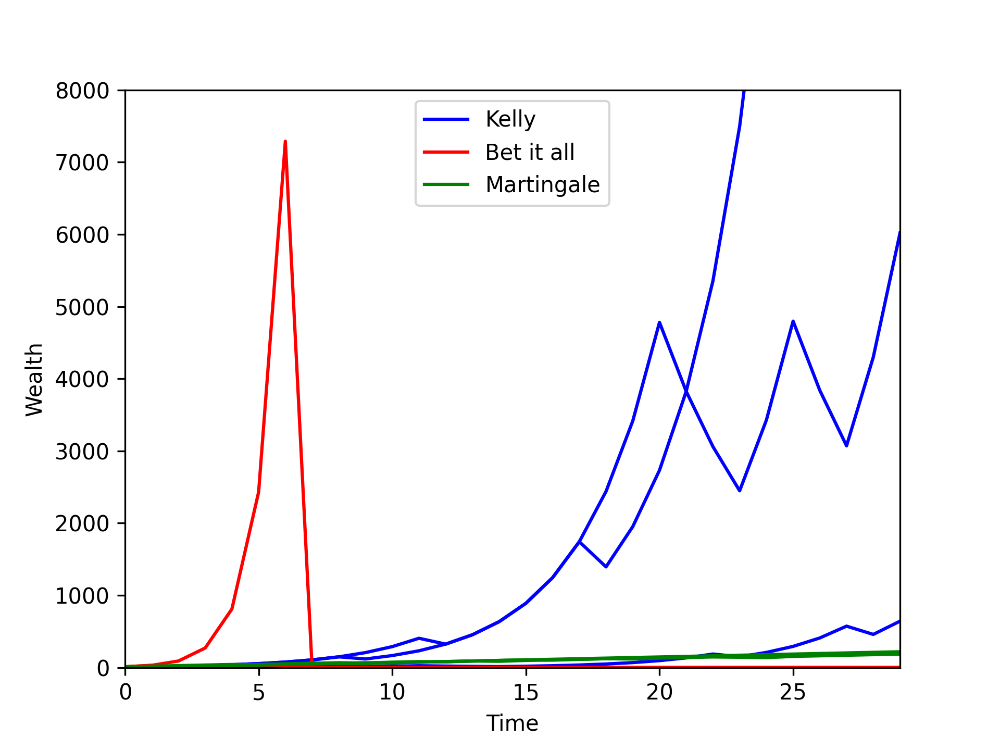

I offer you a game: I'll flip a coin, and you will make a bet. If you guess the result correctly, I'll give you your bet back plus 200% of the bet. If you guess wrong, I'll keep your money. We will play this game many, many times. I ask you for a coin, and you sneakily pass me a biased coin with an 80% chance of landing on heads. Given this, the game seems favourable to you, and you sense that this is indeed a game worth playing (after all, if you say "heads", the probability that you'll be right is 80%).

But what fraction of your available money should you bet each round? 

This article is about how we can answer this question. First, I'll address the Kelly Criterion. It is one (popular) answer. For example, it was highlighted by Ed Thorp when using his famous blackjack strategy, and is also used by people in finance to determine how much of their capital they should use when making bets. I also will describe the link between the Kelly Criterion and the idea of “maximizing log wealth”. Finally, I will touch on when the Kelly Criterion does not apply and what you should do. 

In all cases, we are trying to set up an optimization problem. We want to optimize some function with respect to how much money we should bet. Example functions could be our long-term wealth, or our expected wealth at time $t$, or our expected *log* wealth at time $t$. If we optimize a suitable function, then the amount of money we discover we should bet will make sense. If we optimize an unsuitable function, then what comes out will not make sense. 

If what we want to optimize is a random function (i.e. its outputs vary for a given set of inputs), then we will need to do something to it (such as take an average) so that we can optimize a deterministic read-out/summary of the function.

## The Kelly Criterion and a popular gaming set-up ## 

I need to clarify the key aspects of the game being played and will also generalize it from the initial example:

- The probability that you win, $p$, and the probability that you lose, $q = 1 - p$, is fixed each round.
- If you win, you will get back your initial bet plus an extra $100b\%$, where  $b$ is the return rate. E.g. if you bet £10 and $b=2$, if you win, then you will receive £10 as well as an extra 200% of that (£20), giving you a total take of £30 (£20 of which is profit).
- Whereas, if you lose, you will get back your initial bet minus $100a\%$, where $a$ is the return rate reduction.
- Each round, you will bet a fraction, $f$, of your total wealth.
- There is no minimum bet. 
- You can reinvest your winnings.
- We will play this game a great number of times.

The Kelly Criterion for how much you should bet simply comes about if we try to maximize our wealth in the limit that we play this game an infinite number of times. Under all the listed assumptions, the Kelly Criterion is the *obvious* thing to do.

Let's work through the maths for this. I want to get to an expression for $W_t$, my wealth at time $t$, so that I can then maximize this in the limit $\lim_{t \to \infty}$.

I'll start with a simple case. If I win on the first round of bets, then my wealth, $W_1$, at time, $t=1$, is

$$
\begin{equation*}
\begin{aligned}
W_1 &= W_0 - fW_0 + (1 + b)fW_0 \\\
&= W_0 + fbW_0 \\\
&= W_0(1 + fb)
\end{aligned}
\end{equation*}
$$

where $W_0$ is my initial wealth. The first line of these equations says that if I win, $W_1$ is equal to my initial wealth, minus the stake I wagered, plus the amount I receive back when I win. 

And so, with probability $p$, 
$$
\begin{equation*}
\frac{W_1}{W_0} = 1+fb
\end{equation*}
$$

By similar logic, if I lose (which happens with probability $q$), then
$$
\begin{equation*}
\frac{W_1}{W_0} = 1-fa
\end{equation*}
$$

Now we could repeat this exercise for any $W_t$ and $W_{t+1}$, and so can write

<!-- $$
\begin{equation*}
\begin{aligned} 
\frac{W_{t+1}}{W_t} = \left \\{  
\begin{array}{ll} 
1+fb & \text{with probability } p, \\\ 
1-fa & \text{with probability } q = 1-p. 
\end{array} 
\right. 
\end{aligned}
\end{equation*}
$$ -->

$$
\begin{equation*}
\begin{aligned} 
\frac{W_{t+1}}{W_t} = \bigg \\{
 \begin{array}{ll} 
1+fb & \text{with probability } p, \\\ 
1-fa & \text{with probability } q = 1-p. 
\end{array} 
\end{aligned}
\end{equation*}
$$

What we see from this is that each time I win, my new wealth is equal to my previous wealth multiplied by $1+fb$, and each time I lose, my new wealth is equal to my previous wealth multiplied by $1-fa$. Therefore, I can express my wealth at time $t$, $W_t$, as a function of my starting wealth, $W_0$, like this 

$$
\begin{equation*}
\begin{aligned}
W_t &= W_0\overbrace{(1+fb) \cdots (1+fb)}^{\text{N terms}} \overbrace{(1-fa) \cdots (1-fa)}^{\text{t-N terms}} \\\
&= W_0 (1+fb)^N (1-fa)^{t-N}
\end{aligned}
\end{equation*}
$$

where $N$ is the number of times I win, and $t-N$ is the number of times I lose. I can rewrite this as follows

$$
\begin{equation}
\frac{W_t}{W_0} = (1+fb)^N (1-fa)^{t-N}
% \label{eq:wealth_fraction}
\end{equation}
$$

and this represents the ratio of my wealth at time $t$ to my starting wealth. This is a random variable, as it depends on how many times I win, $N$, and $N$ is random: $N \sim \mathrm{Binomial}(t,p)$.

But I care about the case where I play a huge number of games, and in this limit $\frac{W_t}{W_0}$ becomes deterministic, and then we can just optimize it with respect to $f$. This is shown below.

First, some algebraic manipulation:

$$
\begin{equation*}
\frac{W_t}{W_0} = \big((1+fb)^{\frac{N}{t}} (1-fa)^{\frac{t-N}{t}}\big)^t 
\end{equation*}
$$

And now we take the limit,

$$
\begin{equation*}
\begin{aligned}
\lim_{t \to \infty}\frac{W_t}{W_0}&= \lim_{t \to \infty} \big((1+fb)^{\frac{N}{t}} (1-fa)^{\frac{t-N}{t}}\big)^t \\\
&=  \lim_{t \to \infty} \big((1+fb)^{p} (1-fa)^{q}\big)^t 
\end{aligned}
\end{equation*}
$$

as in $ \lim_{t \to \infty} $, the proportion of wins is $p$ and the proportion of losses is $q$. There is no longer any randomness in this quantity. 

We can go ahead and maximize this with respect to $f$. 

$$
\begin{equation*}
\begin{aligned}
f^* &= \underset{f}{\operatorname*{argmax}} \lim_{t \to \infty} \big((1+fb)^{p} (1-fa)^{q}\big)^t \\\
&=  \underset{f}{\operatorname*{argmax}} \hspace{1mm} (1+fb)^{p} (1-fa)^{q} \\\
&=  \underset{f}{\operatorname*{argmax}} \hspace{1mm} \big( p\mathrm{log}(1+fb) + q\mathrm{log}(1-fa) \big)
\end{aligned}
\end{equation*}
$$

where I choose to maximize the logarithm as it makes calculations easier. This is fine to do as $\mathrm{log}(f(x))$ is a monotonic function so whatever maximizes $f(x)$ will also maximize $\mathrm{log}(f(x))$. 

Also, <a id="specific_anchor">note</a> that the last line is equal to $\underset{f}{\operatorname*{argmax}}\hspace{1mm} \mathbb{E}[\mathrm{log} \big( \frac{W_{t+1}}{W_t} \big)]$. We will come back to this later when making the link to maximizing expected log wealth.

Ok, back to it. To find the maximum of the above expression with respect to $f$, let's differentiate it with respect to $f$ and set it to zero. 

$$
\begin{equation*}
\frac{d}{df} \big(p\mathrm{log}(1+fb) + q\mathrm{log}(1-fa) \big)= \frac{pb}{1+fb} - \frac{qa}{1-fa}
\end{equation*}
$$

and setting this to zero and solving for $f$ (where I'll use $f^*$ to denote the value of $f$ which maximizes the function),

<!-- $$
\begin{equation*}
\begin{aligned}
0 &= \frac{pb}{1+f^* b} - \frac{qa}{1-f^* a} \\\
&= pb(1-f^*a ) - qa(1+f^*b ) \\\
f^* &= \frac{pb-aq}{pba + aqb} \\\
&= \frac{pb-aq}{pba + a(1-p )b} \\\
\end{aligned}
\end{equation*}
$$ -->

$$
\begin{equation*}
\begin{aligned}
0 &= \frac{pb}{1+f^* b}  -  \frac{qa}{1-f^* a} \\\
&= pb(1-f^* a)- qa(1+f^* b) \\\
f^* &= \frac{pb-aq}{pba + aqb} \\\
&= \frac{pb-aq}{pba + a(1-p )b} \\\
\end{aligned}
\end{equation*}
$$

which after some rearranging yields 

$$
\begin{equation*}
f^* = \frac{p}{a} - \frac{q}{b}
\end{equation*}
$$

So for the example given at the start, we should bet $f^* = \frac{0.8}{1} - \frac{0.2}{2} = 0.7$. Each round, we should bet 70% of our existing wealth. 

If I want to maximize my wealth, in the limit I play such a game an infinite number of times, I should bet according to the Kelly Criterion. It is what comes out from doing that optimization!

### The link to expected log wealth ###

Optimizing what we care about (wealth in the limit of infinite rounds) gives the same answer as optimizing expected log wealth, *for this gaming set-up* (we'll show a set-up where it doesn't apply [later on](#a-fixed-maximum-bet-each-round)).

When reading about the Kelly Criterion, I was initially confused about whether it arises from maximizing long-term wealth, or from maximizing expected log wealth. I saw both explanations online. Now, it seems pretty clear to me that it arises from maximizing long-term wealth, and this happens to give the same answer as maximizing expected log wealth. Kelly said in his original paper [1] that the logarithm being present has "nothing to do with the value function which [the gambler] attached to his money". Instead it is present due to the useful fact that the logarithm is additive in repeated bets (so makes calculations easier).

Here's the maths to show their equivalence. [Above](#specific_anchor), I mentioned that we are finding

$$
\begin{equation}
f^* = \underset{f}{\operatorname*{argmax}}\hspace{1mm} \mathbb{E}[\mathrm{log} \big(\frac{W_{t+1}}{W_t} \big)] 
% \label{eq: argmax equation}
\end{equation}
$$

Now, I will show that the value of $f$ which maximizes $\mathbb{E}[\mathrm{log}(W_{t})]$ (the expected log wealth) is equal to $f^*$.

$$
\begin{equation*}
\begin{aligned}
\mathbb{E}[\mathrm{log}(W_{t})] &= \mathbb{E}[\mathrm{log}(W_0\frac{W_{t}}{W_0})] \\\
&= \mathbb{E}[\mathrm{log}(W_0)] + \mathbb{E}[\mathrm{log}(\frac{W_{t}}{W_0})] \\\ 
&= \mathbb{E}[\mathrm{log}(W_0)] + \mathbb{E}[\mathrm{log}\left( (1+fb)^N (1-fa)^{t-N} \right)] \\\
&= \mathrm{log}(W_0)+ \mathbb{E}[N\mathrm{log} (1+fb)] + \mathbb{E}[(t-N)\mathrm{log}(1-fa)] \\\
\end{aligned}
\end{equation*}
$$

where I have substituted in the expression from equation 1, and used the linearity of expectations and logarithm rules to simplify. Now, because N is the random variable here, I can rearrange things in the expectation to get

$$
\begin{equation*}
\begin{aligned}
&= \mathrm{log}(W_0)+ \mathrm{log}(1+fb)\mathbb{E}[N] +\mathrm{log}(1-fa)(t-\mathbb{E}[N]) \\\
&=\mathrm{log}(W_0) + \mathrm{log}(1+fb)tp +\mathrm{log}(1-fa)(t-tp)
\end{aligned}
\end{equation*}
$$

where in the last line, I've used the fact that for a binomial, $N \sim \mathrm{Binomial}(t,p)$, $\mathbb{E}[N] = tp$. 

There are no random variables anymore. Let's take the argmax with respect to $f$ and we will see that this is equivalent to taking the argmax with respect to $f$ from the initial derivation.

$$
\begin{equation*}
\begin{aligned}
\underset{f}{\operatorname*{argmax}} \hspace{1mm} \mathbb{E}[\mathrm{log}(W_{t})] &= \underset{f}{\operatorname*{argmax}} \hspace{1mm} \mathrm{log}(W_0) + \mathrm{log}(1+fb)tp  +\mathrm{log}(1-fa)(t-tp)  \\\
&= \underset{f}{\operatorname*{argmax}} \hspace{1mm} \mathrm{log}(1+fb)tp +\mathrm{log}(1-fa)(t-tp) \\\ 
&= \underset{f}{\operatorname*{argmax}}\hspace{1mm} t(\mathrm{log}(1+fb)p +\mathrm{log}(1-fa)(1-p)) \\\
&= \underset{f}{\operatorname*{argmax}} \hspace{1mm} (\mathrm{log}(1+fb)p +\mathrm{log}(1-fa)(1-p)) \\\
&= \underset{f}{\operatorname*{argmax}} \hspace{1mm} (\mathrm{log}(1+fb)p +\mathrm{log}(1-fa)q) \\\ 
&= \underset{f}{\operatorname*{argmax}} \hspace{1mm} \mathbb{E}[\mathrm{log} \big( \frac{W_{t+1}}{W_t} \big)] \\\ 
&= f^*
\end{aligned}
\end{equation*}
$$

Here, I'm using the fact that when I take the argmax with respect to $f$ of the function $c(a,t,b,p) g(f,a,t,b,p)$, where $c$ is a function not dependent on $f$, that is equal to taking the argmax with respect to f of the function $g(f,a,t,b,p)$. I use this to simplify things, until I get to the expression in equation 2. We know that the argmax of this respect to $f$ is $f^*$.

So for this gaming set-up, there is this nice equivalence.

### Things we shouldn't do ###

Let's stick to the same gaming set-up I introduced at the start and look at things we shouldn't do. Once we step away from being clear what we are trying to optimize, we enter murky territory. Here are some examples.

#### Betting it all each round ####

Although the game set-up seems favourable, we should not bet everything we have each go. If we did, we would *eventually* lose at some point, and then lose all our money and be broke (as if we lose a bet we lose all the money we wagered).

#### Optimizing arbitrary summaries of wealth ####

$W_t$ is a random variable as it depends on how many times you've won or lost (and this is random). If I want to maximize it, I'll need to first get a deterministic read-out of it, and then maximize that.

The wrong thing to do is to just do something like maximizing the expected wealth, $\mathbb{E}(W_t)$ *without considering the implications*. If I want to have as much wealth as possible at time $t$, there's no guarantee that if I go and maximize my *expected* wealth at time $t$ instead, that I'll get what I want. Why would there be? They're different things.

To illustrate the distinction between a random variable and its expected value, consider a game where a fair coin is flipped and if I guess the result correctly I win a million dollars, and if I guess wrong I lose a million dollars. The expected value of my wealth after one flip is the average of these quantities i.e. zero (as with probability 0.5, I win a million dollars, and with probability 0.5, I lose a million dollars). But my wealth is certainly not zero after one flip. After one flip, I could either be very rich, or very poor. The expected value of my wealth is a summary of wealth. Being a summary, it hides useful information such as what possible values of wealth I may actually end up with!

Let's see below what the suggested betting fraction is when maximizing expected wealth, and how following that strategy will lead to disaster for this particular game.

First, to get some intuition, let's look at maximizing $\mathbb{E}[\frac{W_{t+1}}{W_t}]$ with respect to $f$.

$$
\begin{equation*}
\begin{aligned}
\mathbb{E}[\frac{W_{t+1}}{W_t}] &= p(1+fb) + q(1-fa) \\\
&= f(bp - qa) + p + q
\end{aligned}
\end{equation*}
$$

If we want to maximize this with respect to $f$, what we do depends on the sign of $bp-qa$. For the example at the start, $bp-qa = 2\times0.8 - 0.2\times1 = 1.4$. This is positive, so to maximize $\mathbb{E}[\frac{W_{t+1}}{W_t}]$ we should pick the largest $f$ value positive i.e. bet all we can each turn. But we know this will lead to ruin, eventually.

Now, let's consider maximizing expected wealth at a time $t$.

$$
\begin{equation*}
\begin{aligned}
\mathbb{E}[W_t] &= \mathbb{E}[\frac{W_{t}}{W_{t-1}} \frac{W_{t-1}}{W_{t-2}}\cdots \frac{W_1}{W_0} W_0] \\\
&= \mathbb{E}[\frac{W_{t}}{W_{t-1}} ]\mathbb{E}[\frac{W_{t-1}}{W_{t-2}}] \cdots \mathbb{E}[ \frac{W_1}{W_0}] W_0 \\\
&=  \big(\mathbb{E}[\frac{W_{t+1}}{W_{t}} ]\big)^t W_0 \\\
\end{aligned}
\end{equation*}
$$

I can do this as the fractional terms are independent random variables so the expectation of products becomes a product of expectations. The only thing that depends on $f$ is $\mathbb{E}[\frac{W_{t+1}}{W_{t}} ]$ and this is maximized when $f$ is as big as possible, as just shown above.

We know this strategy will lead to eventual ruin, as if you always bet the full amount, eventually you will lose. For example, the probability that you *do not* lose if you play the game 10 times is $0.2^{10} = 10^{-7}$. So the probability you will lose is $1 - 10^{-7}$.

### Other perspectives

#### Simulations

I have included some simulation plots (Figure 1) to show what happens when following different strategies. In all cases, we start of with a wealth of $10$. There are three blue lines corresponding to following a Kelly Criterion strategy. Each corresponds to a different realization of the future if you were to bet according to that strategy. There are different lines as your wins and losses are random. The Kelly strategy beats the rest. The game set-up I gave at the start is so favourable that very soon your wealth explodes.

The "Bet it all" strategy is when you bet all you have each round. Again, three red lines are shown, but two of them quickly end up with zero wealth. For one, there is a winning streak that results in enormous wealth gain until a loss happens, bringing the wealth to zero.

I've also included a "Martingale" strategy. Briefly, here you pick an initial bet size and start betting. If you win, you repeat your initial bet. If you lose, you must now bet enough so as to recover the lost bet, and gain the profit you would have otherwise made. If you lose again, you must now increase your bet further so as to regain the previous losses, and gain the profit you would have made if you had initially won. Because the odds are so favourable for this game, the Martingale strategy in green does result in wealth growth. But it is *far* more slow than the Kelly one. With less favourable odds, a losing streak may well lead you to run out of money as you would be having to keep increasing your bets as you lost until you finally had no more to bet with. When I was younger, I borrowed some money from my mother to try the Martingale strategy out on online roulette. I quickly lost all the money after a string of consecutive losses. I realized my folly and stopped there. If only I had known how to run some simulations and peek at the possible futures!

<figure>
    
    <figcaption>
    Figure 1: Simulations of how three different betting strategies fare for the gaming set-up given at the top of the page.
    </figcaption>
</figure>

#### In the long-run

When we take the limit to infinity, maximizing long-term wealth is equivalent to maximizing long-term expected wealth, as well as long-term expected log wealth.

$$
\begin{equation*}
\lim_{t \to \infty}\mathbb{E}[W_t] =  \lim_{t \to \infty}W_t
\end{equation*}
$$

as in the limit, $W_t$ is deterministic, and the expectation of a non-random quantity, such as $W_t$, is just $W_t$. So whatever maximizes long-term wealth, will also maximize long-term expected wealth.

Similarly,

$$
\begin{equation*}
\lim_{t \to \infty}\mathbb{E}[\mathrm{log}(W_t)] =  \lim_{t \to \infty}\mathrm{log}(W_t)
\end{equation*}
$$

and we know that this is maximized by whatever maximizes $\lim_{t \to \infty}W_t$ as log is montononic. Therefore, whatever maximizes long-term wealth, will also maximize long-term expected log wealth.

## Different gaming set-ups lead to different strategies ##

Sometimes we do want to bet it all each time, and sometimes maximizing expected wealth is the things to do if we want to maximize long-term wealth. It all depends on the gaming set-up, as illustrated below.

### Betting it all

I'll take the initial game set-up at the start of the article, and change one thing: what happens if you lose. Now, if you lose, I'll keep 50% of your bet and return the remainder to you.

When calculating the amount to bet, I should still use $f^* = \frac{p}{a} - \frac{q}{b}$, which yields $f^* =\frac{0.8}{0.5} - \frac{0.2}{2} = 1.5$. This suggests I should be betting everything I have (and maybe even taking out a loan). There's no risk of ruin here, because when I lose I only lose 50% of my stake and there is no minimal bet, so I can keep playing.

### A fixed maximum bet each round ###

Kelly himself provided a counter scenario [1] where you should not bet a fraction $ \frac{p}{a} - \frac{q}{b}$ of your wealth each round. In this scenario, you are only allowed to bet a fixed amount, say £1, each day and you cannot reinvest your winnings. There is an additional assumption that you have endless £1 coins to bet each day. The suggested outcome here to maximize long-term wealth is to bet the full £1 each round, if the probability of winning is greater than for losing each round.

I will show this below. First, for the first round, if you win then $W_1 = W_0 - 1f + 1(1+b)f$ meaning that you new wealth is equal to the previous wealth, minus the stake you've betted, $1f$, plus what you get back if you win, $1(1+b)f$. I'll drop the $1$ moving forward. Whereas, if you lose, then $W_1 = W_0 - f + (1-a)f$, where $(1-a)f$ is how much you get back if you lose. Now this holds for any $W_{t+1}$ and $W_t$, so we can write

$$
\begin{equation*}
\begin{aligned} 
W_{t+1} = \bigg \\{
 \begin{array}{ll} 
W_t+fb & \text{with probability } p, \\\ 
W_t-fa & \text{with probability } q = 1-p. 
\end{array} 
\end{aligned}
\end{equation*}
$$

Now, the wealth at time $t$ just depends on how many times you win or lose

$$
\begin{equation*}
W_t = W_0 + Nfb - (t-N)fa
\end{equation*}
$$

i.e. it is equal to the initial wealth, plus the number of times you win, $N$, multiplied by $fb$, subtract the number of times you lose, $(t-N)$, multiplied by $fa$. 

Now we can take the limit of this 

$$
\begin{equation*}
\begin{aligned}
\lim_{t \to \infty}W_t &= W_0 + ptfb - (t-pt)fa \\\
&= W_0 + ptfb - qtfa
\end{aligned}
\end{equation*}
$$

And now we can find the argmax with respect to $f$

$$
\begin{equation*}
\begin{aligned}
f^* &= \underset{f}{\operatorname*{argmax}} \lim_{t \to \infty} W_t \\\
&= \underset{f}{\operatorname*{argmax}} \hspace{1mm} W_0 + ptfb - qtfa \\\
&= \underset{f}{\operatorname*{argmax}} \hspace{1mm} ft(pb - qa) \\\
&= \underset{f}{\operatorname*{argmax}} \hspace{1mm} f(pb - qa) \\\
\end{aligned}
\end{equation*}
$$

Therefore, if $pb > qa$, you should bet the maximum fraction, $f = 1$, i.e. bet the full £1 each round to maximize long-term wealth. 

This is in fact what you get from maximizing expected wealth, as I'll show here.

$$
\begin{equation*}
\begin{aligned}
\mathbb{E}[W_t] &= \mathbb{E}[W_0 + Nfb - (t-N)fa] \\\
&= W_0 + fb\mathbb{E}[N] - fa\mathbb{E}[t-N] \\\
&= fbtp - fa(t-tp) \\\
&= fbtp - faqp \\\
&= ft(pb-qa)
\end{aligned}
\end{equation*}
$$

and we showed just before this that $\underset{f}{\operatorname*{argmax}} \ ft(pb - qa) = 1$, if $pb > qa$. 

When I saw this, I initially though that ruin is also possible with this strategy if you go on a long-enough losing streak and run out of money. But on considering the assumptions available, it is not, as we assume we have endless £1 coins. I had been thinking of a case where if $a = 1$, meaning if you lose you will lose the full bet amount, and $pb > q$, the suggestion is to bet the full £1 each round. Now, if I start with only £3, there is a scenario with probability $q^3$ that I lose all three bets and am done. I never managed to take the limit to infinity because I ran out of money. However, the assumption of this game is that I do have endless pound coins to bet, so this is not actually an issue here.

Practically, if we impose on ourselves a sufficiently small daily bet limit compared to our actual wealth, then losing all our wealth becomes less of an issue as the chances of going on a streak that wipes out your wealth will become very small. You could show this using hitting probabilities and Markov chains, but that is for a different blog article. In practice, we may choose to bet a smaller fraction of our £1 each day to deal with this (this is referred to as *fractional Kelly*).

## Can you afford to take the limit to infinity?

The strategies that result from optimizing the long-term wealth rely on you playing the game an infinite number of times. In reality, whether these strategies are optimal or not will depend on the game set-up and how many times you do play. That is something you'd have to work out yourself, either with maths or with simulation studies.

As mentioned by Christian Aichinger [2], this is an example of how the "rich can get richer". Although these strategies will give you the most wealth in the long-run, you'll need to be able to handle periods of losses along the way, meaning you'll need enough existing wealth so that if you suffer a period of losses you don't just quit.

## Utility functions and what to do when the above assumptions don't hold

One way the above assumptions won't hold is if you are not playing the game an infinite number of times. Another way they may not hold is if the probabilities of you winning/losing changes each round (as well as the payouts). If this is the case, you can't even do the step of taking a time limit to infinity and ending up with a deterministic function of $f$ which you can then optimize. Instead, *you need to decide* on an appropriate deterministic summary of the random quantity $W_t$ and then optimize it.

This is key. If you care about your wealth at $t = 10$, $W_{10}$, this will be a random variable. A specific value of $f$ can lead to vastly different values of $W_{10}$. It is upto you to decide what is a useful summary of $W_{10}$. Maybe the median of the distribution is. Maybe the expected value, or the expected log value. There are rules of thumb, but ultimately, you must decide what you want to optimize and ensure it aligns with what you actually care about.

Here is an example. We want to bet on football matches. Each time, we will bet if the home team wins or loses. Our estimated probabilities of these things change each game, and the expected payouts also change each game. We are also willing to bet a different fraction, $f$, each round. If we consider the case where we can reinvest our winnings, then

$$
\begin{equation*}
\begin{aligned}
W_t &= W_0(1+f_1b_1)^{r_1}(1-f_1a_1)^{1-r_1}(1+f_2b_2)^{r_2}(1-f_2 a_2)^{1-r_2} \cdots \\\
& \cdots (1+f_tb_t)^{r_t}(1-f_ta_t)^{1-r_t}
\end{aligned}
\end{equation*}
$$

where $f_t$ is the fraction of wealth betted in round $t$, $b_t$ and $a_t$ are the appropriate values of $b$ and $a$ for each round, and $r_t$ is an indicator for if you win or lose: $r_t = 1$ if you win and $r_t=0$ if you lose. So if I win the first round of bets, $r_t = 1$, and I will multiply my initial wealth, $W_0$ by $(1+f_1b_1)$. The term $(1-f_1a_1)^{1-r_1}$ becomes 1. If I then lost the second round of bets, I would multiply my existing wealth $W_0 (1+f_1b_1)$ by $(1-f_2 a_2)$. And so on.

Now you can't take the limit to infinity and do the things we did previously where we can say that the number of wins becomes equal to $tp$. We can't do that as the probability of winning changes each round (as well as the other things).

So it is up to us to decide what an appropriate summary of the wealth is which we can go and optimize. It turns out that the expected log wealth is a reasonable utility function to use. First though, let's see from another perspective why the expected wealth is often a poor function to try and optimize. 

An immediate warning-flag when using any expectation is that we want to have wealth in our single reality, but the expectation averages the wealths over all possible ways the future could have turned out. The expectation of $W_t$ is what you get when you carry out your betting system until time $t$, record how much money you have, and then go back in time to $t=0$ and repeat this, and then repeat this an infinite number of times. You now have infinite possible values of $W_t$ and can take an average of them. This is your expected wealth. But you don't really care about this - this is probably not how your future works. You care about the wealth in your particular future. So we must proceed with caution if we are to use the expected value.

I will illustrate what the expected wealth is for the initial example given in this article, for when you bet the full fraction of your wealth each round (as this is what maximizes expected wealth, as shown [previously](#optimizing-arbitrary-summaries-of-wealth)).

Let's focus on time $t=10$. This argument can be extended to arbitrary $t$. From the definition of expectations,

$$
\begin{equation*}
\begin{aligned}
\mathbb{E}[W_{10}] &= W_0 \mathbb{E}[\frac{W_{10}}{W_0}] \\\ 
&= W_0 \sum_{n=0}^{10}(1+b)^n (1-a)^{10-n} {10 \choose n} p^n (1-p)^{10-n} \\\
&= W_0 \big( (1+b)^0 (1-a)^{10} 1 p^0 (1-p)^{10} \\\
 & \quad \quad + (1+b)^1 (1-a)^9 10 p^1 (1-p)^9 + \cdots  \\\
& \quad \quad + (1+b)^{10} (1-a)^0 1 p^{10} (1-p)^0  \big) \\\
\end{aligned}
\end{equation*}
$$

where I'm using the formula for $\frac{W_{t}}{W_0}$ from equation 1, and setting $t=10$, and remembering that $N$, the number of wins is distributed like $N \sim \mathrm{Binomial}(10,p)$, and using the law of the unconscious statistician to expand $\mathbb{E}[\frac{W_{10}}{W_0}]$. And now substituting in the values of $b = 2$, $a=1$ and $p=0.8$,

$$
\begin{equation*}
\begin{aligned}
\mathbb{E}[W_{10}] &= W_0 \big( (1+2)^0 (1-1)^{10} 1 p^0 (1-p)^{10} \\\ 
& \quad \quad + (1+2)^1 (1-1)^9 10 p^1 (1-p)^9 + \cdots \\\
& \quad \quad + (1+2)^{10} (1-1)^0 1 p^{10} (1-p)^0 \big) \\\
&= W_0 ( 0 + 0 + \cdots + 3^{10} p^{10}) \\\
&= W_0 (3^{10} p^{10}) \\\
&= 6340 W_0
\end{aligned}
\end{equation*}
$$

The only non-zero term is when you win 10 times in a row (highly unlikely). In this case, you end up with massive wealth. In all other cases (the majority) you end up with zero wealth. But because the expectation averages over these possibilities, the expected wealth at $t=10$ is positive. This is simply what we have chosen to optimize. What would be mistaken is to now think that, because the expectation is positive, in the one future we end up in we'll have an increase in wealth.

A common approach to deal with this is to use the expected log wealth instead. The logarithm of small numbers will return a negative number. This way, small wealths get negative penalties in the expectation, actively penalizing situations/worlds where you end up with small wealths. This is in contrast to the above. 

We can see how this works for the same example as above. I will be using the law of the unconscious statistician here, where $\mathbb{E}[\mathrm{log}(X)] = \sum_i \mathrm{log}(x_i) p(x_i)$.

$$
\begin{equation*}
\begin{aligned}
\mathbb{E}[\mathrm{log}(W_{10})] &= \mathrm{log}(W_0) \mathbb{E}[\mathrm{log}(\frac{W_{10}}{W_0})] \\\
&= \mathrm{log}(W_0) \sum_{n=0}^{10}\mathrm{log} \left( (1+b)^n (1-a)^{10-n} \right) {10 \choose n} p^n (1-p)^{10-n} \\
\end{aligned}
\end{equation*}
$$

which is very similar to the above, but with a log in front. So this simplifies to

$$
\begin{equation*}
\mathbb{E}[\mathrm{log}(W_{10})] = \mathrm{log}(W_0) ( \mathrm{log}(0) + \mathrm{log}(0) + \cdots + \mathrm{log}(3^{10} p^{10})
\end{equation*}
$$

Now $\mathrm{log}(0)$ is undefined, but for this example it is good enough to understand it as an infinitely large and negative number. This would make $\mathbb{E}[\mathrm{log}(W_{10})]$ infinitely large and negative, meaning that the strategy of betting it all each round would not be the optimum one.

Maximizing the expected log wealth is therefore a reasonable thing to do, and quite a popular one. 

There are more choices you can make though. What logarithm base should you use, for example. Moreover, as mentioned at the start, you could instead seek to maximize the median of $W_t$ or the mode. In any case, we should understand what optimizing these statistics can lead to, and whether these match with what we actually care about.

## Conclusion

It is one thing to say we want to get lots of wealth. But we still need to think about what we want to optimize as our wealth at a given time is often a random quantity. For certain cases, such as the long-run games mentioned at the start, by choosing to maximize long-term wealth we move to a deterministic function which we can just optimize. In other (maybe more realistic) cases, this does not pop out from the maths. Instead, we have to explicitly choose a summary function of wealth which we want to optimize. The expected log wealth is a popular one. But other choices may be more appropriate based on what we care for.

## Citation

Cited as:

Parthipan, Raghul. (Jan 2024). The Kelly Criterion and making bets. https://raghulparthipan.com/posts/2024-01-08-kelly/.

Or

<pre tabindex="0"><code id="bibtex">@article{parthipan2024kellycriterion,
  title   = "The Kelly Criterion and making bets,
  author  = "Parthipan, Raghul",
  journal = "Raghul Parthipan",
  year    = "2024",
  month   = "Jan",
  url     = "https://raghulparthipan.com/posts/2024-01-08-kelly/"
  }
</code></pre>

## References

1. Kelly, J. L. (1956). A new interpretation of information rate. *the bell system technical journal*, 35(4), 917-926.
2. https://www.caichinger.com/blog/2018/04/19/kelly_criterion4/
3. Thorp, E. O. (2008). The Kelly criterion in blackjack sports betting, and the stock market. In *Handbook of asset and liability management* (pp. 385-428). North-Holland.
4. McEnally, R. W. (1986). Latane's bequest: The best of portfolio strategies. *The Journal of Portfolio Management*, 12(2), 21-30.

