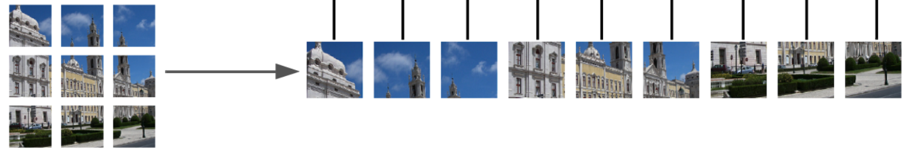

Recently, there have been a great number of ML models which do Numerical Weather Prediction (NWP) with accuracy similar to state-of-the-art physics-based models. Moreover, these ML models are orders of magnitude quicker for creating forecasts. My intention here is to highlight the parts of these ML models which I think are particularly noteworthy. I will be using the following groupings:

1. Efficiency - this explores what techniques are used in order to work with the large data which represents atmospheric states.
2. Dealing with error accumulation - how to minimize errors accumulating over time as forecasts are run. 

Finally, I will comment on what I think needs to be done to take these models further: a) dealing with blurry predictions, b) alternative ways to deal with error accumulation, and c) achieving robust forecasts.

I will start with some background material to set the task up, and then go through the ML NWP models. 

## Background ##

### Task setting ###

Most ML NWP work by taking the state of the atmosphere at a given time, $X_t$, and performing computation on this to output the state of the atmosphere at the next time-step, $X_{t+1}$. One time-step may be 1 hour long, for example. $X_t$ is a pretty large quantity - in **GraphCast** <a href="https://www.science.org/doi/10.1126/science.adi2336" target="_blank" rel="noopener noreferrer">(Lam et al., 2023)</a> it contains 235,680,480 values. This arises because in their training data, the globe is split into $721 \times 1440$ grid cells, and at each cell there are $(5 \textrm{ surface variables} + 6 \textrm{ variables at each vertical level} \times 37 \textrm{ vertical levels})$ atmospheric variables associated. 

The new state is modelled using a function learnt using machine learning, $f_\theta$, to do the updating. In its general form, we can write the update process as
$$
\begin{equation}
    X_{t+1} = f_\theta(X_t, Z_t)
\end{equation}
$$
where $Z_t \sim N(0,1)$ without loss of generality. 

Most of the current work (often implicitly) use the simplification
$$
\begin{equation}
    X_{t+1} = \mu_\theta(X_t) + \sigma Z_t 
\end{equation}
$$
which can also be understood as saying $X_{t+1} \sim N\big(\mu_\theta(X_t),\sigma\big)$. And this class of work trains by variants of mean-squared-error to learn the mean function, $\mu_\theta(X_t)$. 

After training, forecasts are made by taking our initial state, $X_0$, passing it through our model to get our prediction of $X_1$, and then passing this through our model again, and so on.

### Vision Transformer ###

A lot of the work here builds on the Vision Transformer <a href="https://arxiv.org/abs/2010.11929" target="_blank" rel="noopener noreferrer">(Dosovitskiy et al., 2020)</a>, which is a way to use attention and the Transformer architecture <a href="https://arxiv.org/abs/1706.03762" target="_blank" rel="noopener noreferrer">(Vaswani et al., 2017)</a> for images. This is relevant because by considering the state of the atmosphere as an image, we can leverage a suite of ML image tools. The link to images comes by thinking of each grid cell as an image pixel, and of all the variables associated with a grid cell as image channels.

Vision Transformers work by converting an image into a sequence of patches. An image $x_{original} \in \mathbb{R}^{H \times W \times C}$ is reshaped into a sequence of flattened patches $x \in \mathbb{R}^{N \times (P^2 C)}$, where $(H,W)$ is the resolution of the original image, $C$ is the number of channels, $(P,P)$ is the resolution of each image patch, and $N = HW/P^2$ is the resulting number of patches. 

<figure>
    
    <figcaption>
    Fig. 1: Illustration of how patches can be created. The number of patches, $N$, is 9 for this example (Image source: Figure 1 in 
    <a href="https://arxiv.org/abs/2010.11929" target="_blank" rel="noopener noreferrer">
     Dosovitskiy et al., 2020</a>).
    </figcaption>
</figure>

This sequence of patches is then passed through a linear layer, mapping $x$ to a vector which I will call $m \in \mathbb{R}^{N \times d}$. Positional embeddings can then be added, and the resulting sequence can then be passed into standard Transformer layers. 

<figure>
    
    <figcaption>
    Fig. 2: Patch embedding followed by addition of positional encoding (Image source: Figure 1 in 
    <a href="https://arxiv.org/abs/2010.11929" target="_blank" rel="noopener noreferrer">
        Dosovitskiy et al., 2020</a>).
    </figcaption>
</figure>

The attention mechanism used in the Transformer paper learns relationships between different patches. It involves projecting sequences of patches like $m$ into three separate sequences: keys, $K = mW_k$, queries, $Q = mW_q$, and values, $V = mW_v$, where $W_k,W_q,W_v \in \mathbb{R}^{d \times d}$. The output is a weighted sum of the values, where the weight assigned to each value is determined by the dot-product of the corresponding query and key:

$$
\begin{equation}
\begin{aligned}
\operatorname{attention}(m) &= \operatorname{softmax}\bigg(\frac{mW_q(mW_k)^T}{\sqrt{d}}\bigg) mW_v \\\
&=  \operatorname{softmax}\bigg(\frac{QK^T}{\sqrt{d}}\bigg) V 
\end{aligned} 
\end{equation}
$$

## Efficiency

The attention process results in high memory and computational costs, scaling quadratically with the number of patches, $O(N^2)$. The memory cost arises from needing to store the pairwise attention scores in the $N \times N$ matrix $QK^T$. And the computational cost arises as $N^2$ operations are required when multiplying the attention matrix by the values. This means that if a large number of patches are used (which is the case if one wishes to capture more intricate relationships), then the memory/computational cost may become too large. 

Therefore, a number of the ML NWP papers use techniques to make the attention mechanism cheaper or faster to run.  

### Shifted window attention

**Pangu-Weather** <a href="https://www.nature.com/articles/s41586-023-06185-3" target="_blank" rel="noopener noreferrer">(Bi et al., 2022)</a> uses a shifted window attention mechanism as proposed in Swin Transformer <a href="https://arxiv.org/abs/2103.14030" target="_blank" rel="noopener noreferrer">(Liu et al., 2021)</a> to improve the efficiency of the attention mechanism. 

There are two parts to this. First, attention is computed in non-overlapping windows, such as shown in "Layer l" in Figure 3 below. If a window contains $M$ patches, the computational complexity of windowed attention is still quadratic in $M$, but this is not an issue since $M$ is fixed and often relatively small ($M=144$ for Pangu-Weather). Importantly, the computational complexity only scales *linearly* with the total number of patches, $N$. 

We can see this by considering splitting up a frame consisting of $N$ patches into $k$ windows of size $M$ patches, such that $N = kM$. When computing attention, there will be a computational cost of order $O(kM^2)$, as it must be done on $k$ windows, each consisting of $M$ patches. For a given $M$, this cost scales linearly with $k$. $k$ is directly proportional to $N$, so the cost scales linearly with $N$.

To make this more concrete, first consider only the top left quadrant of the part of Figure 3 which is labelled "Layer l". There are $N=16$ patches split into $k=1$ window of size $M=16$ patches. The complexity of attention is $O(16^2)$. Now consider all four quadrants of "Layer l". There are $N=64$ patches split into $k=4$ windows of size $M=16$ patches. The compexity is $O(16^2 \times 4)$. It has only scaled linearly with the total number of patches.

<figure>
    
    <figcaption>
    Fig. 3: Shifted window approach from Swin Transformer (Image source: Figure 2 in 
    <a href="https://arxiv.org/abs/2103.14030" target="_blank" rel="noopener noreferrer">
        Liu et al., 2021</a>).
    </figcaption>
</figure>

The second part of the Swin Transformer architecture deals with the fact that the window-based attention alone does not provide connections across windows: a patch in a given window does not pay attention to patches in other windows, which limits flexibility. To achieve cross-window connections, the attention windows are then shifted as shown in "Layer l+1" in Figure 3.

The windowed attention and shifted-window attention layers always follow one another. 

### Fourier transforms

**FourCastNet** <a href="https://arxiv.org/abs/2202.11214" target="_blank" rel="noopener noreferrer">(Pathak et al., 2022)</a> use a Fourier approach which maintains the global dependencies which attention captures, whilst providing computational efficiencies. The gist of the idea is to take attention and reformulate in such a way that when certain assumptions are made, it can be computed in Fourier space with less computational complexity.

To see this, <a href="https://ar5iv.labs.arxiv.org/html/2111.13587" target="_blank" rel="noopener noreferrer">Guibas et al.</a> show how attention can be rewritten as follows:

$$
\begin{equation}
\operatorname{attention(x)[s] = \sum_{t=1}^{N}}x[t]\kappa[s,t] 
\end{equation}
$$

where $x[t]\kappa[s,t] = x[t]K[s,t]W_v$, and $K = \operatorname{softmax}(\frac{xW_q(xW_k)^T}{\sqrt{d}})$. This is simply picking out the $s^{th}$ component of $\operatorname{attention}(x)$ as defined in Equation 3. 

<!-- We can understand $\kappa[s,t]$ as a kernel function. -->

The continuous version of this sum is defined as follows

$$
\begin{equation}
\varkappa(X)[s] = \int_D \kappa(s,t)x(t) dt
\end{equation}
$$

Informally, we may think of this continuous form as what arises if we were to split an image into an infinite number of patches. 

Now, if we only consider kernels of the form $\kappa(s,t) = \kappa(s-t)$, we get

$$
\begin{equation}
\varkappa(X)[s] = \int_D \kappa(s-t)x(t) dt
\end{equation}
$$
which is a global convolution. This no longer has a direct correspondence with attention, but it still involves mixing different patches together (as done in attention), and, usefully, we can use the Convolution theorem to rewrite it as

$$
\begin{equation}
\varkappa(X)[s] = \mathcal{F}^{-1}\big(\mathcal{F}(\kappa) \cdot \mathcal{F}(x)\big)[s]
\end{equation}
$$
where $\mathcal{F}$ and $\mathcal{F}^{-1}$ are the continuous Fourier transform and its inverse, respectively.

Inspired by this, for images on a discrete grid, the idea is to mix patches by using the discrete Fourier transform (DFT):

1.  First, the sequence of patches, $x \in \mathbb{R}^{N \times d}$ are transformed to the Fourier domain with $z_N = [\operatorname{DFT}(x)]_N$. 

2. Next, mixing is performed: $\tilde{z}_N = W_N z_N$, where $W = \operatorname{DFT}(\kappa) \in \mathbb{C}^{N \times d \times d}$. 

3. Finally, the inverse Fourier transform is used along with a residual connection: $y_N = [\operatorname{IDFT}(\tilde{z})]_N  + x_N$.

This has a computational complexity of $O(N\operatorname{log}(N)d^2)$, arising from $O(N\operatorname{log}(N))$ for the DFT and then $O(d^2)$ for the multiplication with $W$.

The approach in **FourCastNet** uses an adapted version of this <a href="https://ar5iv.labs.arxiv.org/html/2111.13587" target="_blank" rel="noopener noreferrer">(Adaptive Fourier Neural Operators)</a> which is more parameter-efficient and improves robustness.

### Graph approaches

**KeislerNet** <a href="https://arxiv.org/abs/2202.07575" target="_blank" rel="noopener noreferrer">(Keisler, 2022)</a>, **GraphCast** <a href="https://www.science.org/doi/10.1126/science.adi2336" target="_blank" rel="noopener noreferrer">(Lam et al., 2023)</a> and **GenCast** <a href="https://arxiv.org/abs/2312.15796" target="_blank" rel="noopener noreferrer">(Price et al., 2023)</a> all make use of Graph Neural Networks (GNNs). These map (encode) data from a regular latitude/longitude grid (shown in Fig 4) to a latent space defined on an icosahedron grid as shown in Fig 5. In this latent space, ML computation is carried out. Finally, the resulting state is mapped back (decode) onto the lat/lon grid again. 

<figure>
     <!-- Adjust the percentage as needed -->
    <figcaption>
    Fig. 4: Regular lat/lon grid. Grid points are equally spaced along both latitude and longitude  (Image source: Figure 3 in 
    <a href="https://www.nature.com/articles/s41586-023-06185-3" target="_blank" rel="noopener noreferrer">
        Bi et al., 2022</a>).
    </figcaption>
</figure>

<figure>
     <!-- Adjust the percentage as needed -->
    <figcaption>
    Fig. 5: An example of an icosahedron grid (Image source: Figure 1 in 
    <a href="https://www.science.org/doi/10.1126/science.adi2336" target="_blank" rel="noopener noreferrer">
        Lam et al., 2023</a>).
    </figcaption>
</figure>

Using GNNs helps with efficiency for a few reasons:

1. The icosahedron grid has a homogeneous spatial resolution over the globe, helping use compute more efficiently than if a regular lat/lon grid was used. For a regular lat/lon grid, we can see in Fig 4 that there are far more grid cells near the poles than the equator. For this lat/lon grid, if a classical Vision Transformer approach was used, there would be far more patches per square area near the poles than the equator, meaning the poles would get a disproportionate amount of compute. 
2. GNNs can be seen as a sparse version of full attention, again improving efficiency. GNNs require specification of what nodes in the graph interact with what other nodes. Nodes generally do not interact with every other node (as would be the case for full attention), but rather nodes in a specified neighbourhood. 

## Error accumulation 

A known issue with autoregressive modelling in ML is that of error accumulation. This is also known as exposure bias in the ML literature. The idea relates to how standard training of autoregressive models (based on maximizing the likelihood) involves training to predict the next state conditioned on the **true** past states. 

However, at simulation/inference time, we first use our model to predict the next state of the atmosphere conditioned on an initial state, and then we **feed our predicted state** back into the model for it to predict the next state. And so on. Therefore, there is a discrepancy between training and testing in how past data is used. 

Now, each time a model makes a prediction it will make some error. So when the model is fed back its previously-predicted states, one symptom of this train-test discrepancy is that errors can accumulate as the forecast is run. And sometimes this can lead to major instabilities and undesirable forecast behaviours.

A number of papers try to address this.

### Roll-out training ###

An approach used by numerous ML NWP is that of roll-out training, which is very similar to Scheduled Sampling <a href="https://arxiv.org/abs/1506.03099" target="_blank" rel="noopener noreferrer">(Bengio et al., 2015 )</a> approach in the ML literature. The idea is to actually do training under the situation where model-generated data is indeed fed back into the model, making training more similar to simulation time.

Here, an initial condition $X_i$ is taken, and then the ML model is used to create a forecast of the next $3$ time-steps for example, $\hat{X}\_{i+1}, \hat{X}\_{i+2},  \hat{X}\_{i+3}$, where I use the circumflex to denote these are values predicted by the ML model. Remember, these are created by feeding $X_i$ into the ML model to get $\hat{X}\_{i+1}$, and then feeding $\hat{X}\_{i+1}$ in to get $\hat{X}\_{i+2}$ and so on. $\hat{X}\_{i+1}, \hat{X}\_{i+2},  \hat{X}\_{i+3}$ are then compared to the true values of the states at these times, $X\_{i+1},X\_{i+2},X\_{i+3}$, using a version of the mean-squared-error as a loss function.

Here is the loss function that would correspond to this:

$$
\begin{equation}
\operatorname{Loss}(\textrm{dataset}) = \mathbb{E}_{X_i \sim \textrm{dataset}} \sum\_{N=1}^3 (X\_{i+N} - \hat{X}\_{i+N})^2
\end{equation}
$$

In words, we measure the MSE between $X\_{i+N}$ and $\hat{X}\_{i+N}$, given the starting state $X_i$, for $N = 1, 2$ and $3$, and then average over all possible starting states, $X_i$, as provided by your training data.

### Hierarchical multi-step forecasting

**Pangu-Weather** uses four models that forecast on different horizons: 1-hour, 3-hour, 6-hour and 24-hours. These are then used in a greedy manner to make forecasts. For example, if we wish to have a 25-hour forecast, we would run the 24-hour forecast once, followed by the 1-hour one. This is similar to an approach used by <a href="https://royalsocietypublishing.org/doi/pdf/10.1098/rsta.2021.0200" target="_blank" rel="noopener noreferrer">Liu et al.</a>. 

<figure>
     <!-- Adjust the percentage as needed -->
    <figcaption>
    Fig. 6: Two different ways to forecast 25 time-steps ahead.
    </figcaption>
</figure>

It is perfectly valid to directly model $X_{25}$ conditioned on $X_1$, instead of modelling it in smaller (e.g. 1-hour) increments. The multi-step approach is nice because it reduces the chances of errors accumulating over time because there are fewer calls of the forecast model, so fewer opportunities for errors to be fed back in and accumulate. It also is quicker for getting forecasts at a specific lead-time. If we wish to have the forecast for 25-hours ahead, we only need to run two model iterations (the 24-hour model and the 1-hour model), as opposed to the 25 model iterations if we only possessed a 1-hour forecast model. So this is a nice approach if we, say, just want to predict $X_{26}$ given $X_1$.

 <!-- I think it would be good if this modelling paradigm was used with the architectures from other models (e.g. diffusion). The reason why you may wish to model sequentially is if you wished to create a simulator which could be run continuously i.e. you don't know how long you wish to generate from it for. It gives you a simulator. -->

If, however, we wish to create a trajectory of the next 26 hourly states in this manner we get temporal inconsistencies. We would get $X_2$ and $X_3$ hour forecasts by applying the 1-hour forecast model twice. But then we'd get $X_4$ by applying the 3-hour forecast model conditioned on $X_1$. This will be based of a model for the distribution of $X_4|X_1$, but this will not capture the correlations between $X_4$ and the previously generated states, $X_2$ and $X_1$. 

<!-- Pangu-Weather is based on the Swin Transformer architecture. Here is an overview of what happens in Fig 2 of the paper. You get your variables, and make them into patches as per ViT. Shifted window attention is used to parition feature maps into windows, with attention applied in each window. Then shifted, and attention applied again. This has lower cost (memory and computation) compared to full self-attention. I can show this in 2D with some figures showing what attention is being used, what the patches are and what the attention window is, and what's the complexity. Can use the Swin figure. -->

<!-- And unlike sliding window attention, all query patches in a window have the same key set. This means sliding window attention requires custom libraries (e.g. longformer's CUDA kernel) to be optimized.  -->

#### With a single model

**Stormer** <a href="https://arxiv.org/abs/2312.03876" target="_blank" rel="noopener noreferrer">(Nguyen et al., 2023)</a> uses a single model, trained to forecast at three different time-horizons. It achieves this taking in the forecast-ahead-time as an input. This is similar to Pangu-Weather, except that a single model is used. 

The idea is that this allows for greater regularization since a single model is trained on a larger dataset (composed of 6-hour-ahead, 12-hour-ahead and 24-hour-ahead predictions).

Unlike Pangu-Weather though, after a pre-training phase which involves just predicting a given fixed forecast time ahead, they then do a roll-out training stage.

## Future directions

### Dealing with blurry forecasts by modelling correlated noise

It is noted in a number of ML NWP papers that forecasts are blurry. Small-scale features are often not present or not as sharp as desired. 

I believe this is due to only predicting the mean, and relying on an underlying probability model that uses uncorrelated, Gaussian noise. There are a few things to unpack from this claim. Most work uses the (often implicit) probability model:
$$
\begin{equation}
    X_{t+1} = \mu_\theta(X_t) + \sigma Z_t 
\end{equation}
$$
with $Z_t \sim N(0,I)$. This means that $X_{t+1}$ is modelled as a Gaussian distribution with mean $\mu_\theta(X_t)$ and a diagonal variance (uncorrelated, independent noise). This body of work then just uses the mean, $\mu_\theta(X_t)$, when predicting $X_{t+1}$. This is bound to be blurry because it is the mean estimate.  

Now drawing samples from the probability model by adding on $\sigma Z_t$ to the mean is not likely to do any better though, since the noise is uncorrelated. It would be akin to adding salt-and-pepper noise as shown in Figure 7.

<figure>
     <!-- Adjust the percentage as needed -->
    <figcaption>
    Fig. 7: An example of what a picture looks like once (more) Gaussian noise is added (Image
    <a href="https://medium.com/analytics-vidhya/remove-salt-and-pepper-noise-with-median-filtering-b739614fe9db" target="_blank" rel="noopener noreferrer">
        source</a>).
    </figcaption>
</figure>

The solution is to use a probability model that can model *correlated* noise. **GenCast** does this, using a diffusion model. The underlying probability model can be written as:
$$
\begin{equation}
    X_{t+1} = f_\theta(X_t, Z_t) 
\end{equation}
$$
Gaussian noise gets injected at the *start*, and is processed, along with $X_t$ to come up with a sample of the new state, $X_{t+1}$. I think diffusion-based approaches make a lot of sense here, given they provide a nice way to get at correlated noise, and there is already a lot of ML literature on them.

### Better handling of error accumulation using batch models

The roll-out forecast method to deal with error accumulation has an issue, which was highlighted by <a href="https://arxiv.org/abs/1511.05101" target="_blank" rel="noopener noreferrer">Huszar</a> in the ML literature. Briefly, the roll-out objective corresponds to the objective function you get when maximizing the log-likelihood of a model which models $X_1,...,X_N$ as conditionally independent given $X_0$ i.e. a model which generates $X_1$ dependent only on $X_0$, and then $X_2$ dependent only on $X_0$ and so on. Therefore, training for the roll-out objective does not encourage temporal correlations to be learnt. 

Given that most of the NWP models require forecasting a fixed time-horizon ahead (e.g. 10 to 15 days), we can side-step the error accumulation issue which arises from autoregressive forecasts, and just forecast the whole 10-15 days in one-shot i.e. in a batch. Autoregressive models make sense when we do not know how many forecast steps we may want to take. For example, in ChatGPT, a response may be very short or very long, so an autoregressive model makes sense to be used here. But if in NWP we always want to forecast a given legnth, we might as well just use a model that does just that. In maths, we can model $X_1,...,X_N|X_0$ directly. We input $X_0$ and simply get out $X_1,...,X_N$.

Now, what model should we use? I think a lovely option would be something similar to Open AI's <a href="https://openai.com/research/video-generation-models-as-world-simulators" target="_blank" rel="noopener noreferrer">sora</a> model. Although the full details aren't out yet, this seems to be a model that generates high-resolution videos in one-shot using diffusion. The one-shot nature of it deals with error accumulation, and the diffusion approach will help with modelling correlated noise. The diffusion is done in a latent space to alleviate memory/compute issues from dealing with many frames of high-resolution video. We would need to do something similar if applying this to the atmosphere. GenCast took inspiration from diffusion models for generating images. We ultimately want to forecast multiple states, so taking inspiration from diffusion models which generate videos seems like something that is asking to be done!

### Achieving robustness using causal ML

The current ML which is used is just based on learning correlations. This contrasts traditional NWP which is built on equations representing our physical understanding. Physical laws encode causal mechanisms for processes, and these are inherently robust. Therefore we have high trust in traditional NWP to generalize to new scenarios, and to perform well if interventions are done on the system (as may be carried out when scientists perform experiments using NWP models). 

If we want our ML models to also be robust and work well in novel scenarios, then we will need to train ML models to learn causal relationships too. This will become more important when we use ML to do extended range, S2S forecasts and even longer. The longer the time-horizon of the forecast, the more likely it is that the Earth's state will move further and further away from what it looked like in the training data. Models will need to generalize well to therefore perform well. 

There's no obvious off-the-shelf tool to deploy here. It's an open research question, and one which I've been thinking about for the past year. I think it will be an important piece of the puzzle going forward!

## Citation

Cited as:

Parthipan, Raghul. (Feb 2024). ML for Numerical Weather Prediction. https://raghulparthipan.com/posts/2024-02-15-ml-nwp/.

Or

<pre tabindex="0"><code id="bibtex">@article{parthipan2024mlnwp,
  title   = "ML for Numerical Weather Prediction,
  author  = "Parthipan, Raghul",
  journal = "Raghul Parthipan",
  year    = "2024",
  month   = "Feb",
  url     = "https://raghulparthipan.com/posts/2024-02-15-ml-nwp/"
  }
</code></pre>

