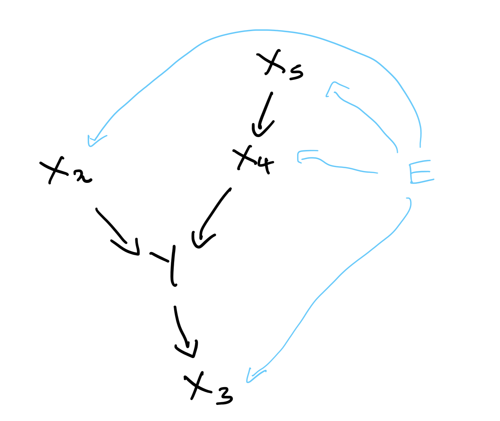
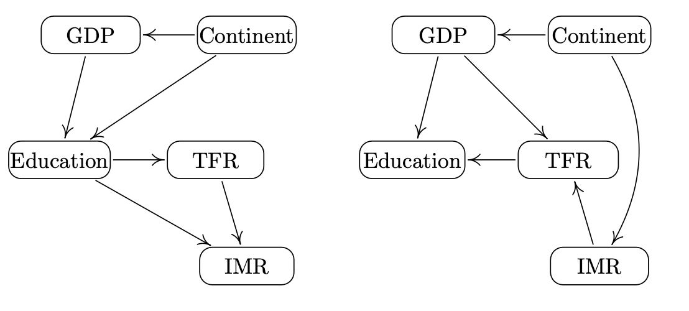
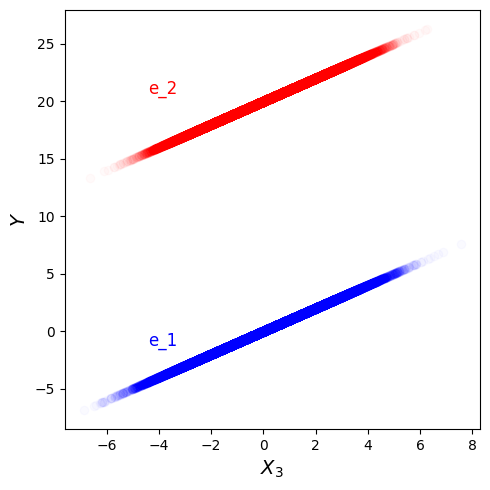
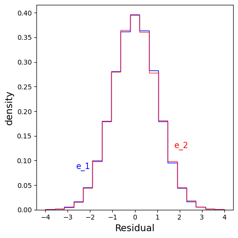
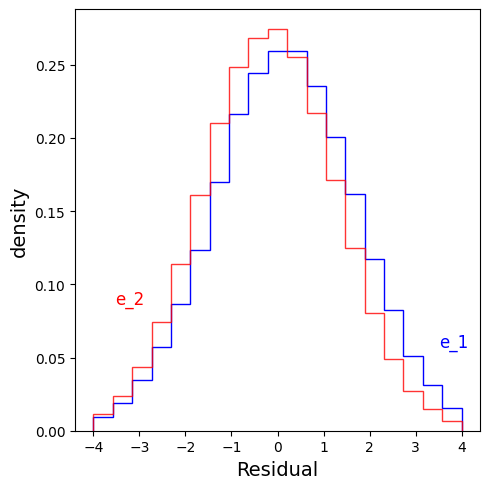
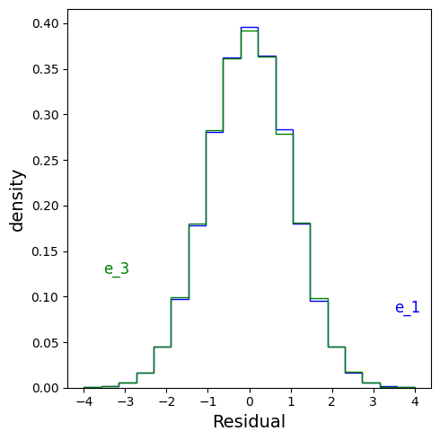
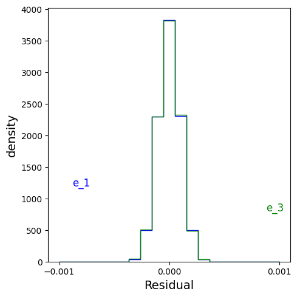
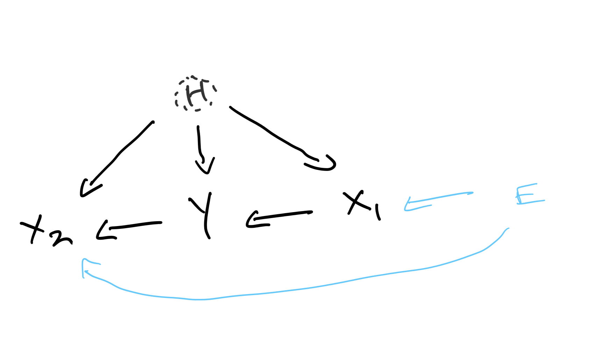
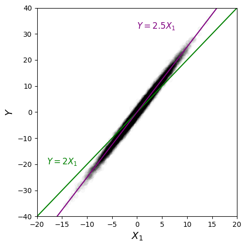
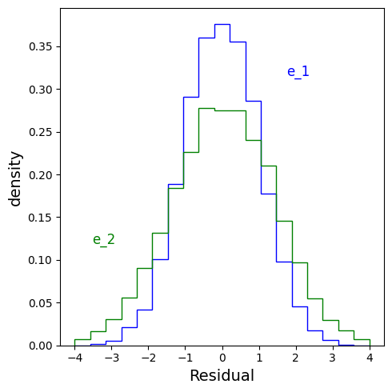

There are a number of reasons we may wish to learn causal mechanisms when modelling a system/forecasting the weather/classifying an image. If our model captures the underlying causal mechanisms, it should be robust to new scenarios (e.g. the future), and it should still produce sensible results if we alter the input ("make an intervention"). Intervening on a system and seeing how things end up helps us make decisions. 

The issue is that the majority of existing ML tools simply learn correlations. They do pattern-matching, and there are no guarantees that what they learn will apply to novel scenarios. This is a key reason why scientists have a natural hesitancy when using these tools compared to physics-based models. One view of science is that it is about discovering the causal mechanisms which explain phenomena. If we wish to use ML for science, then we should try and learn these causal mechanisms, not coincidental patterns.  

In the past few years, there has been a body of work (e.g. <a href="https://arxiv.org/abs/1501.01332" target="_blank" rel="noopener noreferrer">Peters et al., 2015</a> and <a href="https://arxiv.org/abs/1907.02893" target="_blank" rel="noopener noreferrer">Arjovsky et al., 2019</a>) bringing causality and data-driven methods together based on the idea of invariance. I want to write about the link between learning the causal mechanisms in a system ("what variables cause other variables") and learning "invariant predictors". A key part of this is having training data which is collected into distinct "environments" (e.g. different locations, different times etc.). Informally, invariant predictors are models that make predictions which are equally as good regardless of the environment.

A popular example to illustrate this is the classification of images of cows and camels. When shown an image of a cow in the desert (Figure 1), an ML model may often misclassify it as a camel. The reason for this is that during training, the vast majority of the cow images are of cows in grassy areas, and those of camels are of camels in sandy areas (Figure 2). 

<figure>
    
    <figcaption>
    Fig. 1: An unusual picture of a cow in a desert. But it is obviously a cow.
    </figcaption>
</figure>

<figure>
    
    <figcaption>
    Fig. 2: Classic backgrounds we would expect in pictures of cows and camels.
    </figcaption>
</figure>

Therefore, pattern-matching ML may just learn that if there is a green background, it should predict there to be a cow, and if there is a yellow background, it should predict there to be a camel. This is known as a "spurious correlation". We don't wish to make predictions based on spurious correlations, as they may not be robust to new environments. An invariant predictor would make predictions which don't depend on the background (which can be considered as part of the environment) of the image. This means it would not make predictions based on spurious correlations, but based on the desired properties, such as animal shapes, instead. Such properties better represent the features we would use ourselves to classify an image as a cow or camel. 

Another example is that of physical "laws" of nature. Consider the equation $F = ma$. This is a causal relationship as if I intervene on a system with a body of mass $m$ and exert a force $F$, then it will get an acceleration $a$. The law is also invariant to environments: it applies equally well now vs 2000 years ago, and whether I do my experiment in the UK or Peru. More generally, we can think of physical laws as representing the underlying causal mechanisms (or explanations) of a system. They describe which variables drive which other variables. And we expect these to hold true across environments. That is what makes them laws. 

## A concrete example

<!-- Let's consider a regression task, where we want to predict a target $Y$ based on some predictor variables $X$. We wish to learn a predictor based on causal mechanisms, not spurious correlations. We will use the common assumption that the environment only affects (either indirectly or directly) the $X$ variables and not the $Y$, and that $Y$ does not affect the environment.  -->

Let's consider a regression task, where we want to predict a target $Y$ based on some predictor variables $X$. We wish to learn a predictor based on causal mechanisms, not spurious correlations. We will use the common assumption that the environment does not directly cause the $Y$ variable ($E$ is not a "parent" of $Y$) and that the $Y$ does not cause the environment ($E$ is not a "child" of $Y$). 

Imagine that the true underlying graph of the system looks like this:

<figure>
    
    <figcaption>
    Fig. 3: Graphical diagram for observed variable case. 
    </figcaption>
</figure>

Different environments can be thought of as different interventions on $X$. $E$'s effect on a $X$ may be a hard intervention, such as setting it to a specific value, or a softer one, such as altering the distribution. Although $E$ is drawn as a direct cause of $X$ in Fig 3., it need not be. We just need to note that for different $E$, the structural equations of $X$ may be modified in any way.

Consider  $X$ and $Y$ are linked by the below causal mechanisms in a particular environment, $e_1$:

<!-- The environment variable, $E$'s affect on a $X$ may be a hard intervention, such as setting it to a specific value, or a softer one, such as altering the distribution. Although $E$ is drawn as a direct cause of $X$ in Fig 3., it need not be. We just have that for different $E$, the structural equation of $X$ may be modified in any way. Consider  $X$ and $Y$ are linked by the below causal mechanisms in a particular environment, $e_1$: -->

$$
\begin{equation*}
\begin{aligned}
X_5 &\leftarrow \operatorname{Gaussian}(0,0.5) \\\
X_4 &\leftarrow X_5 + \operatorname{Gaussian}(0,1) \\\
X_2 &\leftarrow \operatorname{Gaussian}(0,0.5) \\\
Y &\leftarrow X_4 - X_2 + \operatorname{Gaussian}(0,1) \\\
X_3 &\leftarrow Y + \operatorname{Gaussian}(0,0.0001)
\end{aligned}
\end{equation*}
$$

In a different environment, $e_2$, we may have instead:

$$
\begin{equation*}
\begin{aligned}
X_5 &\leftarrow \operatorname{Gaussian}(2,0.5) \\\
X_4 &\leftarrow 0.5X_5 + \operatorname{Gaussian}(0,1) \\\
X_2 &\leftarrow 1 \\\
Y &\leftarrow X_4 - X_2 + \operatorname{Gaussian}(0,1) \\\
X_3 &\leftarrow Y + \operatorname{Gaussian}(20,0.0001)
\end{aligned}
\end{equation*}
$$

Note that the structural equation for $Y$ is unchanged by the new environment, following our assumptions. 

For simplicity, I've used linear relationships and additive noise but these aren't required.

Again, our task is to find a model for $Y$ based on the $X$. The only information we have is that we have access to groupings of our data by environment, and that the environment only affects the $X$, not the $Y$. We therefore will be seeking to both discover the underlying graph into $Y$ ("causal discovery"), and also learn the form of the relationships between $X$ and $Y$ ("causal estimation"). 

A real-world example given by <a href="https://arxiv.org/abs/1706.08576" target="_blank" rel="noopener noreferrer">Heinze-Deml et al.</a> for such a set-up is the task of modelling the total fertility rate, $Y$, in a country. What are the drivers for changes in fertility? There are many theories. For example, one theory argues that economic growth is responsible for declines in fertility; and another that it is the transmission of new ideas which drives declines. Therefore, let's assume that all the causal drivers exist in the following set of $X$ variables: IMR (infant mortality rate), GDP variables (e.g. GDP per capita, GDP per capita growth) and Education. A potential environmental variable is continent of the country. If it is to be an environmental variable, we assume that it is not affected by the fertility rate (which is reasonable). And that the fertility rate is not directly affected by the continent - continent only indirectly affects it through mediating variables such as GDP. Given this, here are two potential compatible graphs, or causal explanations, of the system:

<figure>
    
    <figcaption>
    Fig. 4: Potential causal graphs. (Image source: Figure 1 in 
    <a href="https://arxiv.org/abs/1706.08576" target="_blank" rel="noopener noreferrer">
        Heinze-Deml et al., 2018</a>)
    </figcaption>
</figure>

We wish to find i) which variables have arrows that go into TFR (what are the "parents" of TFR), and ii) what are the functional relationships between TFR and its parents. The invariance approach to causality can help us tackle such problems.

**The central insight:**  for the true causal parental set of $Y$, denoted $X_S$, we have:

$$
\begin{equation}
Y \perp\\!\\!\\!\\perp  E \ | \ X_S
\end{equation}
$$
which states that $Y$ is independent of $E$ given $X_S$. Informally, once we condition on the true parental set, $X_S$, this screens off any further information that $E$ could provide us about $Y$. The only way that $E$ can affect $Y$ is through the parents of $Y$, after all. Therefore, $Y$ is independent of $E$ once we know $X_S$. This is a simple relationship, but has powerful applications.

 The invariance approach is based on finding predictors which satisfy this relationship. If a predictor does not obey it, the predictor won't represent the causal mechanisms. If we have enough distinct environments, there will be only one predictor that obeys this and that will represent the true causal mechanisms for $Y$. However, in the case where we don't have sufficient environments, there may be many predictors that obey this property, and the true causal mechanism will be captured by one of them, but we may not be able to say which one.

Here are some examples to illustrate the conditional independence relationship in action.

### A predictor which doesn't satisfy the invariance relationship

Imagine if we only had data for $e_1$. If I used linear regression to fit a model of $Y$ on $X$, I may learn something like:

$$
\begin{equation*}
Y = X_3 + \operatorname{Gaussian}(0,0.0001)
\end{equation*}
$$

We have learnt a spurious correlation &mdash; our model depends on $X_3$. But in reality, $X_3$ is a child of $Y$. If we intervened on $X_3$, $Y$ should not change. But our linear regression suggests it would change. No wonder the linear regression has learnt to use $X_3$ though. After all, from the structural equations, $X_3$ is only a small bit of noise away from $Y$. 

This predictor would work terribly in $e_2$ though, since $X_3$ is very different to $Y$ there!

Having a predictor which uses child variables is easily something that can happen when we use standard ML techniques (e.g. fitting by mean-squared-error), and is something we would wish to prevent. 

We know this isn't an invariant predictor, but let's show how this links to equation 1 not being satisfied. A qualitative way to do this is to plot a scatter plot of $Y$ vs $X_3$ and use blue to represent data from $e_1$ and red to represent data from $e_2$. This is done in Figure 5, and we can see that for a given value of $X_3$, the distribution of $Y$ is very different between the two environments. Therefore $X_3$ is not the parent set. 

<figure>
    
    <figcaption>
    Fig. 5: $Y$ vs $X_3$ for the two environments.
    </figcaption>
</figure>

### Sufficent environments: a sole predictor which satisfies the invariance relationship

Now, if we have both $e_1$ and $e_2$, we will find that only $X_S = \\{X_2, X_4 \\}$ satisfies equation 1. To see this, we can take all possible sets $X_S$, and do what is called an "invariant residual distribution test". This is described below.

From the structural equation for $Y$, we see that in all environments:

$$
\begin{equation*}
Y \leftarrow X_4 - X_2 + \operatorname{Gaussian}(0,1)
\end{equation*}
$$

This means that in all environments, the residual

$$
\begin{equation*}
R = Y - X_4 - X_2 = \operatorname{Gaussian}(0,1)
\end{equation*}
$$

has the same distribution. 

The invariant residual distribution test involves i) fitting models to predict $Y$ using various subsets $X_S$, ii) calculating the residuals, and iii) assessing whether the residuals have the same distribution across all environments. This should be the case if we have an invariant predictor.

Informally, we can understand how this corresponds to checking equation 1 as follows. In step one, we fit a model to $Y$ which makes use of the information from $X_S$. This model should make use of all the relevant information. If $X_S$ is the parent set, then based on equation 1, once we use $X_S$ (i.e. condition on it) to predict $\hat{Y}$, there is no more information that $E$ provides about $Y$. Which means that the residual $Y - \hat{Y}$ should not depend on $E$, which is what the invariant residual distribution test assesses. 

For this example, only $X_S = \\{X_2, X_4 \\}$ has invariant residuals. Below, I plot the residuals across environments for a predictor using $\{X_2, X_4 \}$, and one using $X_2$ alone. We see that the former residuals are invariant and the latter aren't. 

When I do linear regression on $Y$ based on $\{X_2, X_4 \}$, I learn:

$$
\begin{equation*}
Y = X_4 - X_2
\end{equation*}
$$

which is the true causal mechanism. The residuals are:

<figure>
    
    <figcaption>
    Fig. 6: Residual distributions for $X_S = \{ X_2, X_4\}$.
    </figcaption>
</figure>

When I do linear regression on $Y$ based on $X_2$, I learn:

$$
\begin{equation*}
Y =  - 0.33X_2
\end{equation*}
$$

and the residuals are:

<figure>
    
    <figcaption>
    Fig. 6: Residual distributions for $X_S = X_2$. The distributions are different across the environments. 
    </figcaption>
</figure>

Note: this test only works when the structural equation for $Y$ has additive noise. But variants of this can be used even when you have other types of noise.

<!-- We then assess (using a hypothesis test) whether the prediction accuracy on a test set of the model which uses $(X_S, E)$ is better than that which only uses $X_S$. If equation 1 holds, then the performance of both models should be indistuinshable, as $E$ should not provide any further information than that given by $X_S$.  -->

### Insufficient environments: many predictors which satisfy the invariance relationship

Imagine we only have data from $e_1$ and $e_3$, where the structural equations for $e_3$ are:

$$
\begin{equation*}
\begin{aligned}
X_5 &\leftarrow \operatorname{Gaussian}(0,0.2) \\\
X_4 &\leftarrow X_5 + \operatorname{Gaussian}(0,1) \\\
X_2 &\leftarrow \operatorname{Gaussian}(0,0.5) \\\
Y &\leftarrow X_4 - X_2 + \operatorname{Gaussian}(0,1) \\\
X_3 &\leftarrow Y + \operatorname{Gaussian}(0,0.0001)
\end{aligned}
\end{equation*}
$$

The only difference between $e_1$ and $e_3$ is a difference in noise variance for $X_5$. The environments are very similar, so we are not going to gain much from the second one. This means that we will have a number of predictors which satisfy the invariance relationship. All we know is that the true causal predictor is one of these. 

For example, using the invariant residual distribution test, we see that for $X_S = \\{X_2, X_4\\}$, the residuals are invariant:

<figure>
    
    <figcaption>
    Fig. 7: Residual distributions for $X_S = \{ X_2, X_4\}$. 
    </figcaption>
</figure>

but they are also invariant for $X_S = X_3$:

<figure>
    
    <figcaption>
    Fig. 8: Residual distributions for $X_S = X_3$. 
    </figcaption>
</figure>

We would need more diversity in environments to proceed further.

## A general procedure to use the invariance relationship for causality

The general idea is to fit different predictors to the data, but only keep the ones which obey the invariance property in equation 1. The selection of only the models which obey the invariance property can be understood as the procedure to discover which variables cause $Y$ (causal discovery). And the model fitting part gives us estimates of the coefficients in the functional relationships between these variables and $Y$ (causal estimation).  

## Unobserved/hidden variables 

In real-world situations, often we have unobserved ("hidden") variables which act as "confounders" meaning they influence both $Y$ and $X$. A typical set-up which is studied (called an instrumental variables set-up) is where the hidden variable $H$ may be causal for both $Y$ and $X$, and the environment, $E$, only affects (directly or indirectly) $X$. $E$ has no effect on $H$, which is a standard assumption for instrumental variable models. The underlying causal diagram may look like:

<figure>
    
    <figcaption>
    Fig. 9: Graphical diagram for when we have unobserved variables. 
    </figcaption>
</figure>

and the structural equations can be written as:
$$
\begin{equation*}
\begin{aligned}
X &\leftarrow f(E,H,Y,\nu) \\\
Y &\leftarrow aX_1 + g(H,\epsilon)
\end{aligned}
\end{equation*}
$$
where $f$ and $g$ are functions, and $\nu$ and $\epsilon$ are random noise variables. The hidden variable will have some distribution which is the same across all environments. 

Again, we can see that the residual:

$$
\begin{equation*}
R = Y - aX_1 = g(H,\epsilon)
\end{equation*}
$$

is the same across all environments (as $\epsilon$ and $H$ do not vary with $E$, according to our assumptions). 

<!-- Therefore, we could take a predictor $Y = \alpha X_1 + \beta X_2$, and try to learn estimates of $\alpha$ and $\beta$, such that the residual, $R = Y - \alpha X_1 - \beta X_2$, is invariant across environments. If the only predictor that was compatible was $Y = \hat{\alpha} X_1$, then we would have discovered that only $X_1$ causes $Y$, and not $X_2$, and we would also have learnt that $a = \hat{\alpha}$.  -->

Therefore, we could fit predictors for $Y$, calculate their residuals and check if they are invariant across environments. If we happened to find that the only predictor compatible was $Y = \hat{\alpha} X_1$, then we would have discovered that only $X_1$ causes $Y$, not $X_2$, and we would also have learnt that $\hat{\alpha} = a$. 

One difficulty in this unobserved variable case is the actual fitting process. Even if we fit $Y$ based on $X_1$, we may not learn $Y = aX_1$ due to the presence of the unobserved variables. This isn't an issue in the all-variables-observed examples above. 

This is easier to explain with an illustration. Imagine there were no hidden variables, and the structural equation for $Y$ was:

$$
\begin{equation*}
Y \leftarrow 2X_1 + \operatorname{Gaussian}(0,1)
\end{equation*}
$$

If we do linear regression to model $Y$ given $X_1$, i.e. fit $Y = \alpha X_1 + \operatorname{Gaussian}(0,\sigma)$, I would (more or less) learn $\alpha = 2$, even if we only had a single environment. 

But if we have hidden variables, consider having the following structural equations for $e_1$:

$$
\begin{equation*}
\begin{aligned}
H &\leftarrow \operatorname{Gaussian}(0,2) \\\ 
X_1 &\leftarrow 2H + \operatorname{Gaussian}(0,0.01) \\\
Y &\leftarrow 2X_1 + \operatorname{Gaussian}(0,1) + H
\end{aligned}
\end{equation*}
$$

Now if we fit $Y = \alpha X_1 + \operatorname{Gaussian}(0,\sigma)$ to this, we no longer learn $\alpha = 2$. This is obvious if I generate some data and plot $Y$ vs $X_1$:

<figure>
    
    <figcaption>
    Fig. 10: The line $Y = 2X_1$ is different to what is learnt when fitting the scatter plot data. Fitting $Y$ based on $X_1$ does not recover $\alpha = 2$ when using this dataset. 
    </figcaption>
</figure>

If we fit $Y = \alpha X_1 + \operatorname{Gaussian}(0,\sigma)$, we learn $\alpha = 2.5 $. This is a problem as if we now did an invariance residual test based on this, the residuals are different (shown in Figure 11) between this environment and $e_2$:

$$
\begin{equation*}
\begin{aligned}
H &\leftarrow \operatorname{Gaussian}(0,2) \\\ 
X_1 &\leftarrow 3H + \operatorname{Gaussian}(0,0.01) \\\
Y &\leftarrow 2X_1 + \operatorname{Gaussian}(0,1) + H
\end{aligned}
\end{equation*}
$$

<figure>
    
    <figcaption>
    Fig. 11: The residuals are different across the environments.
    </figcaption>
</figure>

But it would be wrong to conclude from this test result that $X_1$ is not a parent of $Y$!

Therefore, with this hidden variables set-up, we still wish for the invariance property to hold true. It is just harder to go about testing if a particular subset of $X$ satisfies it, since it is not as simple as just fitting a model based on those $X$ and then doing the invariance residual test. 

<!-- However, doing the fitting is more challenging than for the case where we have no unobserved variables. This is because. Peters page 23. I think its cos when you fit y = alpha x_1, we won't learn alpha = a (unlike for observed variables case), due to hidden variable's presence  -->

## Citation

Cited as:

Parthipan, Raghul. (April 2024). The link between causality and invariant predictors. https://raghulparthipan.com/posts/.

Or

<pre tabindex="0"><code id="bibtex">@article{parthipan2024invariance,
  title   = "The link between causality and invariant predictors,
  author  = "Parthipan, Raghul",
  journal = "Raghul Parthipan",
  year    = "2024",
  month   = "April",
  url     = "https://raghulparthipan.com/posts/2024-04-05-causality-and-invariance/"
  }
</code></pre>

