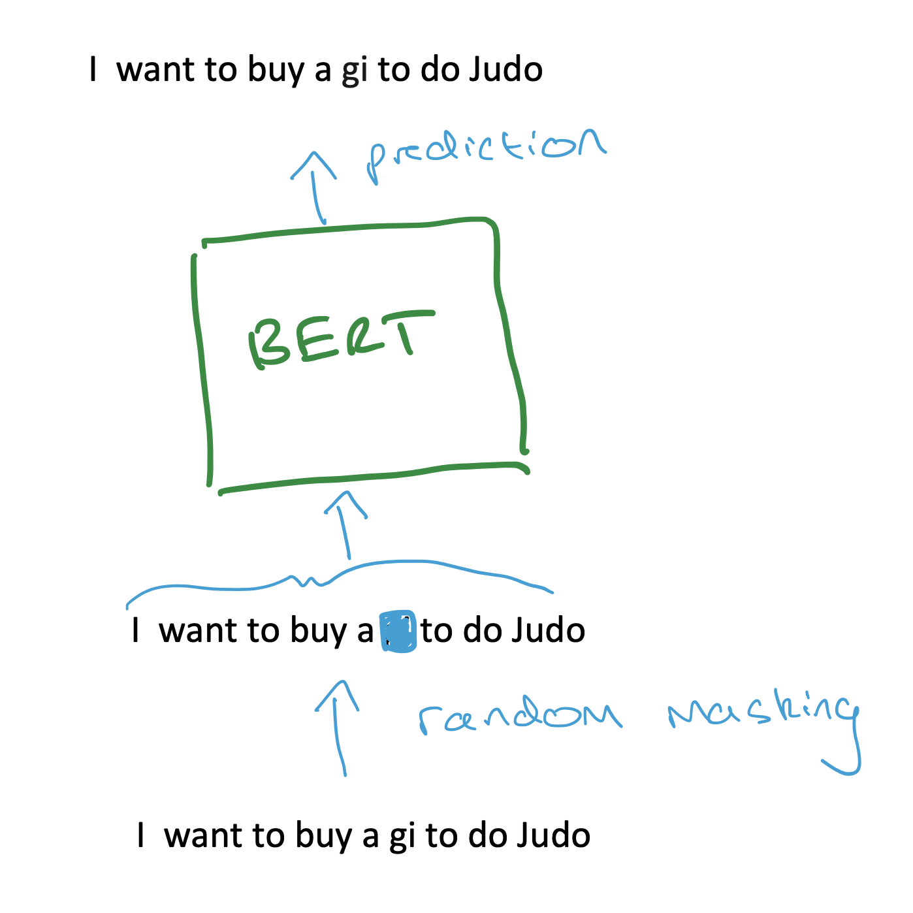
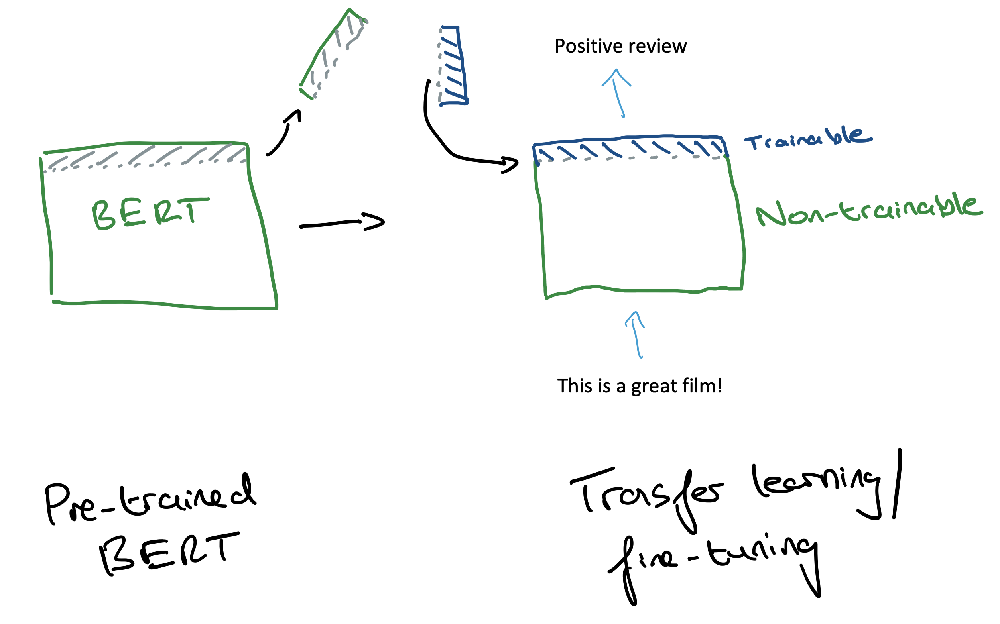
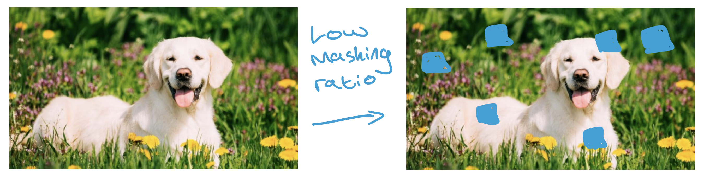
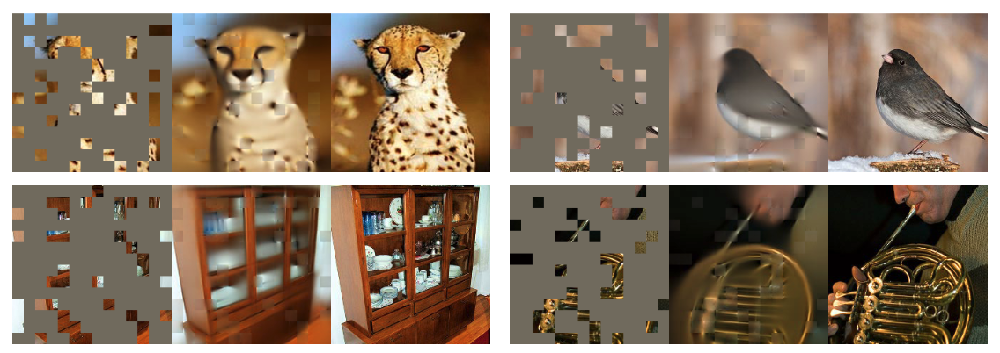
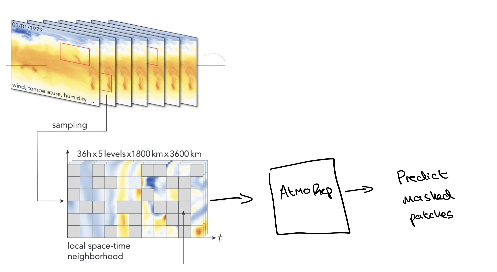
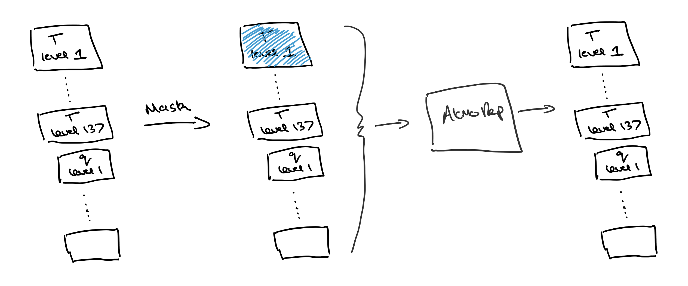
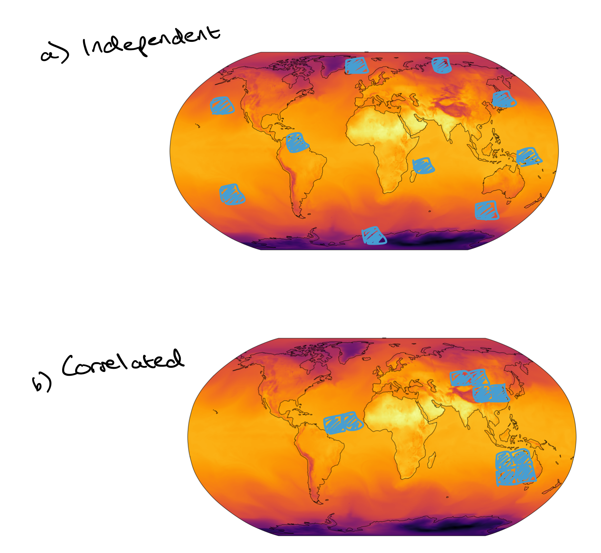
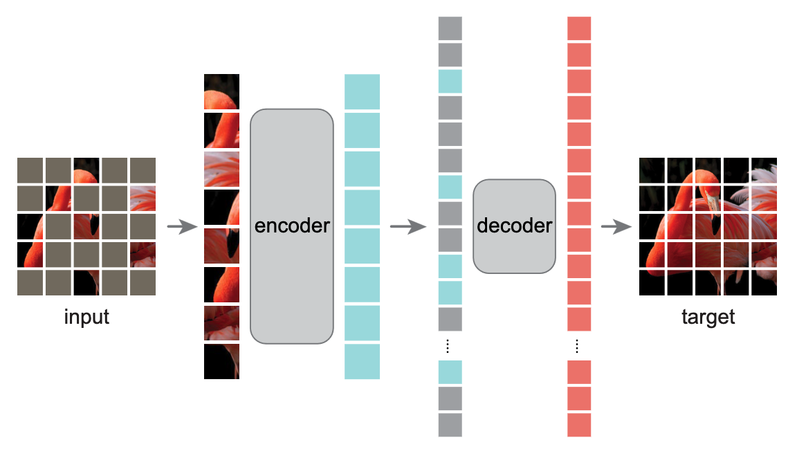

Representation learning has been hugely beneficial to the process of getting machine learning (ML) to do useful things with text. These useful things include getting better search results from a Google search, and synthesizing images given text prompts (such as done by models like DALL-E). Representation learning is about learning meaningful ways to mathematically represent input data, such as sentences. The power of representation learning is that a *single* ML model can often extract mathematical representations of an input (e.g. a sentence) which are useful for a *great number* of downstream tasks (e.g. doing a Google search, or using the sentence to condition DALL-E). Training a good representation learning model may take considerable time and expertise to figure out what the model should actually be, and then significant time and resources to train it. But once that is done, downstream users can fine-tune it or do transfer learning with it to adapt it to their particular task &mdash; and this fine-tuning is far more manageable for smaller-scale users.

**AtmoRep** <a href="https://arxiv.org/pdf/2308.13280.pdf" target="_blank" rel="noopener noreferrer">(Lessig et al., 2023)</a> is the first step towards a general-purpose representation model for weather and atmospheric data. 

Here's a clear use-case of such a tool: we now have a wide-range of ML models for Numerical Weather Prediction (NWP), as detailed [here](), which can rapidly produce forecasts. Many are open-source too. Downstream users, such as businesses, are looking to use the weather predictions from these ML NWP as input features for downstream prediction tasks. How should they do this? One option is to just train an in-house ML model from scratch to do this downstream task. But based on the impact of representation learning for text, a better option may be to first use a general-purpose weather representation model to take in the predicted weather states and extract useful mathematical representations, and *then* train an in-house ML model to fine-tune these. This latter option would be far quicker, less costly and probably easier to do, since the representation extraction task has already been done, so the in-house ML model has fewer things it needs to learn.

I will first give a brief overview of **BERT** <a href="https://arxiv.org/abs/1810.04805" target="_blank" rel="noopener noreferrer">(Devlin et al., 2018)</a>, a popular representation model for text, since its training process has inspired other representation learning models, including AtmoRep. I'll also bring up a key paper in representation learning of images: **Masked Autoencoders are Scalable Vision Learners** <a href="https://arxiv.org/abs/2111.06377" target="_blank" rel="noopener noreferrer">(He et al., 2021)</a>. Then I'll cover what I find are the key aspects of AtmoRep. Finally, I'll write about some future directions which I think are exciting.

## Language representation learning with BERT ##

In 2018, the BERT model was used to improve Google search. Here's one of their examples:

<figure>
    
    <figcaption>
    Fig. 1: Example of BERT improving Google searches (Image source: <a href="https://blog.google/products/search/search-language-understanding-bert/" target="_blank" rel="noopener noreferrer">here</a>). 
    </figcaption>
</figure>

With BERT, the inherent meaning of the search query is able to be better extracted. BERT is good at extracting meaningful representations from text. 

One of the key things responsible for this is the "masked language modelling" training strategy. In Figure 2, I show a schematic of it. We take a sentence, hide ("mask") around 15% of the words, and pass this sentence along with the masked words into BERT. We then train BERT to predict what these masked words actually are. BERT itself consists of Transformer layers which are used to look at the input sentence and to use the unmasked words to infer what the masked words are. 

<figure>
    
    <figcaption>
    Fig. 2: Schematic of the masked training procedure for BERT. The word "gi" gets randomly masked out, and BERT must use the remaining words to predict that the missing word is "gi".
    </figcaption>
</figure>

And when it comes to downstream tasks, we can take BERT, remove its last few layers, and add some new layers (Figure 3). We can then fine-tune these new layers to do our specific task, such as sentiment analysis.

<figure>
    
    <figcaption>
    Fig. 3: After BERT has been trained, the final layers can be removed and new ones can be added. These new layers can then be trained on a specific task, such as sentiment analysis.
    </figcaption>
</figure>

### Why BERT-style masking may work and when it may not ###

It is somewhat surprising (to me at least) that this masking training process is so effective in learning how to devise useful representations. I don't think we know exactly what makes it work so well. One intuitive explanation which I read  in "Masked Autoencoders are Scalable Vision Learners" (henceforth MAE) is that masked training works so well because language is so information-dense. Therefore, training a model to predict a few missing words in a sentence forces it to develop sufficient language understanding. For example, in Figure 2, if we were to predict the masked word "gi" ourselves, we would need to look at the *whole* sentence and rely on our understanding of language to figure out what makes sense. Therefore, maybe a ML model must learn to do the same. 

However, if we move away from text to images, the same masking procedure may not be appropriate. If we were to mask out 15% of an image, we may still be able to predict the masked parts simply by looking at their unmasked neighbours and interpolating (Figure 4). Sophisticated high-level understanding of what is going on in the image would not be necessary. This contrasts with the case for language! He et al. discuss this and address the issue by simply masking far more of the training images. In Figure 5, they mask 80% of the images, and train their model to recover the masked parts. This is supposed to force the model to learn more high-level features &mdash; no longer is interpolation a viable strategy to solve the task &mdash; and it is a key part of their representation learning method for images. 

<figure>
    
    <figcaption>
    Fig. 4: It is pretty simple to figure out what the masked patches are. We could just interpolate based on the neighbouring ones.
    </figcaption>
</figure>

<figure>
    
    <figcaption>
    Fig. 5: Ground-truth images are on the right. 80% of patches are masked (left) and MAE reconstructions are shown in the middle. No longer is it simple to figure out what are the masked patches (Image source: Fig. 2 in <a href="https://arxiv.org/abs/2111.06377" target="_blank" rel="noopener noreferrer">He et al., 2021</a>). 
    </figcaption>
</figure>

## AtmoRep ##

AtmoRep uses a masked training procedure, illustrated in Figure 6. It is trained by taking a spatially local set (instead of the full global data, for efficiency reasons) of weather fields (e.g. temperature, humidity) across a certain time-window, masking out parts of these fields at different points in space and time, and then training a model to recover the masked values. 

<figure>
    
    <figcaption>
    Fig. 6: Masked training process for AtmoRep. Local space-time neighbourhoods are randomly sampled from the global data, and then patches are randomly masked. The training task is to reconstruct these masked patches. Figure is adapted from Fig. 1 in <a href="https://arxiv.org/abs/2308.13280" target="_blank" rel="noopener noreferrer">Lessig et al., 2023</a>.  
    </figcaption>
</figure>

The model itself is based on Transformer layers. One of the nice contributions in AtmoRep is a modular design: separate Transformer layers are used for separate physical fields, and these are then coupled together using cross-attention. This means that we can do field-specific pre-training of these layers, and then couple them together for a final training phase. This is shown to speed up overall training, since it is less costly than doing the whole coupled training from scratch. In addition, the model is trained to output samples from a probability distribution, but I won't go into this any further here as I'll be focussing on the representation learning theme.

AtmoRep is shown to do two types of tasks. The first one follows closely from the masked training objective. Input data is passed in, along with some unknown (masked) quantities which are then predicted. One example task is temporal interpolation, where atmospheric data at a given temporal resolution can be recast to a higher temporal resolution. AtmoRep is trained on hourly data, so given an atmospheric dataset at, say, 3hr resolution, we can pass this into the AtmoRep model, with the intermediary hourly time-steps passed in as masked patches. AtmoRep can then be used to fill in these hourly gaps, thereby doing temporal interpolation. 

The second type of task is an extension of the first. AtmoRep is used to create some outputs (e.g. gridded atmospheric variables), and these are then fed as inputs into a separate model which is trained to perform a task such as downscaling. 

As a side note, there is a link between models like AtmoRep which use masked training procedures and models from the Neural Process family. Neural Process models like the **Transformer Neural Process** <a href="https://arxiv.org/abs/2207.04179" target="_blank" rel="noopener noreferrer">(Nguyen et al., 2022)</a> and **Taylorformer** <a href="https://openreview.net/pdf?id=JbwpM5rJs5" target="_blank" rel="noopener noreferrer">(Nivron et al., 2023)</a> use a similar masking procedure in training to encourage learning a property called "consistency" (which I won't go into here). Given the benefit of the masked training procedure for representation learning, there seems to be a link between learning "consistent" processes and learning good representations. 

## Future directions

### Using AtmoRep in a BERT-like manner

Once BERT has been trained, downstream users just need to alter the last few layers, and then fine-tune these on their task. This contrasts with how AtmoRep has currently been shown to be used: the current results seem to be for tasks where the actual outputs of the base AtmoRep model are used (either directly, or indirectly by being fed into another network). Whilst it is great that it can perform a wide range of tasks, I think to really tap into the power of representation learning for atmospheric dynamics, we should see where the BERT protocol takes us &mdash; let's take AtmoRep, replace its final layers, and then fine-tune the new layers on a specific task of interest.

For example, in hydrology, flood forecasting is a common task. ML has been deployed here, with the goal being to predict streamflow (volume of water that moves over a specified point, per unit of time). Some of the input features into an ML hydrology model are forecasted weather states, such as 2 metre temperature, and total precipitation. Currently, these are directly fed into the ML hydrology model. But instead, it may be beneficial to first pass these weather states into AtmoRep, and then use the last hidden layer (which has hopefully learnt some useful representation) as input into the hydrology model. 

### Representation learning for different types of weather data

The downstream user may wish to feed in recent observational data as input to their models, along with forecasted weather states (whether they be forecasted by ML or traditional means). NWP forecasts are made based on an initial weather condition, and this initial condition is created (using a process called "data assimilation") using recent observational data. Data assimilation is quite costly, so it can take a few hours for new initial conditions to become available for use in forecasts. Now, a downstream user may have observational data from *after* the data assimilation was performed (i.e. more up-to-date observational data), or they may have access to local observational data sources that centres like the ECMWF do not have when doing data assimilation. And this downstream user may wish to make use of this observational data in their model.

Figuring out how representation learning should be done for these data sources is an open question. Will we have a general-purpose model to extract representations from both gridded forecasts and un-gridded observations, or will we employ separate models?

### What training strategy encourages useful representations?

Similar to the discussion [here](#why-bert-style-masking-may-work-and-when-it-may-not) on MAE, in AtmoRep the masking ratio was increased (to between 0.5 and 0.9) compared to BERT to encourage learning better representations. I suspect there are various custom ways we can mask atmospheric data such that we encourage the learning of useful representations. Here is one candidate: mask *all* of a given field (e.g. all temperature values at a given vertical level) and train the model to reproduce this, given data from the other fields (Figure 7). This would force the model to learn good inter-variable representations. 

<figure>
    
    <figcaption>
    Fig. 7: Masking the whole temperature field at the first atmospheric level, and learning to reconstruct it based on other fields.
    </figcaption>
</figure>

Another candidate: instead of independently sampling which patches to mask, sample in a correlated fashion such that if a patch is chosen to be masked, it is more likely that neighboring patches will be too (Figure 8). This will make it harder for a model to just rely on interpolation since there will be huge chunks of the field missing. And so this may encourage better representations to be learnt.

<figure>
    
    <figcaption>
    Fig. 8: Masking 2 metre temperature. In both a) and b) there are 10 masked patches. Their positions are independent in a) but correlated in b). Image is modified from Figure 47 in <a href="https://www.science.org/doi/10.1126/science.adi2336" target="_blank" rel="noopener noreferrer">
        Lam et al., 2023</a>.
    </figcaption>
</figure>

### Scaling up to more data

It is for efficiency reasons that AtmoRep uses a local, not global, space-time window. As discussed [here](), the "attention" operation is expensive for larger data. One approach which could address this, again from He et al., is to train a masked autoencoder with an asymmetric encoder-decoder design. As shown in Figure 9, a large encoder can be trained to map only the unmasked patches to a latent representation. A high masking ratio significantly reduces the number of patches which are passed into the encoder, thereby reducing computational cost. The encoder is what is responsible for learning the useful representations, so the reduction in computational cost due to fewer input patches allows us to scale up our encoder and make it more powerful.  

A lightweight decoder can then be used to process the latent representations and the masked patches, and reconstruct the image. 

For downstream tasks, the decoder is scrapped, and extra layers can be appended to the end of the encoder in order to fine-tune for specific tasks. 

<figure>
    
    <figcaption>
    Fig. 9: Masked autoencoder with asymmetric encoder-decoder design. Only the unmasked patches are fed into the encoder, which is responsible for the learning of good representations  (Image source: Fig. 1 in <a href="https://arxiv.org/abs/2111.06377" target="_blank" rel="noopener noreferrer">
        He et al., 2021</a>).
    </figcaption>
</figure>

## Citation

Cited as:

Parthipan, Raghul. (April 2024). Representation learning for weather data. https://raghulparthipan.com/posts/2024-04-19-representation-learning-for-weather/.

Or

<pre tabindex="0"><code id="bibtex">@article{parthipan2024representationlearning,
  title   = "Representation learning for weather data,
  author  = "Parthipan, Raghul",
  journal = "Raghul Parthipan",
  year    = "2024",
  month   = "April",
  url     = "https://raghulparthipan.com/posts/2024-04-19-representation-learning-for-weather/"
  }
</code></pre>

<!-- questions for christian - what is the xattention procedure. is the amsking in fig 1 same across time/fields, cos it looks like it -->

<!-- 
Think BERT for atmospheric data. 

What is BERT and what is it used for - e.g. powers improvements in Google search; general purpose text embedding. Use BERT's last layers. 

ChatGPT is great for generating text. But if you want to take some text and use that as input into another model, we use BERT. 

Why does the training tasks for BERT work so well? Do we know?

.....

AtmoRep is nearly there. It uses the same training approach as BERT, processing local spacetime windows. 

It shows how it can be used for tasks like interpolation (what it is trained for) -> link to NP/stochastic process/Taylorformer

Multiformer idea - pretrain individual transformers for each field. And then combine them in a later training step. Seems like a nice approach.

weird loss -what is the modelling assumption?

[other tasks it does, like counterfactuals, im not sure about - they aren't trained for, and dont learn causal stuff. bias correction etc. maybe not worth attacking them in the blog]

And can be used for downstream tasks - you'd use Atmosrep to predict some quantities, and then use another network to take its predictions further. [what is the use of the atmosrep part though. for downscaling for example, you could just do that directly on the NWP]

But I think the approach can be taken further than what's it is being used for.

....

Vision: we have ML NWP that make quick forecasts. How do the downstream user make use of this? Take the product and then use it as features in another model. Use Atmorep to learn the best representations and then use that.

Can have representation for NWP gridded products. All are based on ERA5, so a general purpose ERA5 learner works here. And also a representation learner for recent observational data. This can then all get fed into a downstream product. You can switch in and out different pretrained ML NWP models as you wish.

May need to play around like how MAE scalable vision learner does, to figure out how to learn best representations

Related to that paper: maybe a better masking operation would be to mask a large area of temp say, and get it to be learnt. That could encourage better representations. For language, each word has a strong meaning and so you need knowledge to reproduce it. For images/physics, you can just extrapolate from neighbouring pixels to a degree. A task that requires more knowledge/understanding would be to work out what the temp would be in a large region, given other variables in that region. Or use more masking as in the scalable vision learner.

A difference with BERT is that atmospheric data is massive - more patches. Efficiency issue. One thing to do is to train an autoencoder on atmospheric data. Compress and then do the same BERT training approach in the latent space. Would using global data save us some stuff here? -->