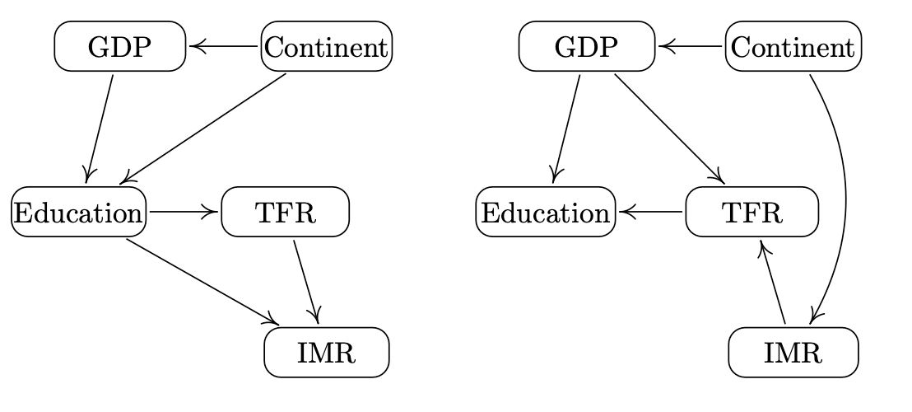
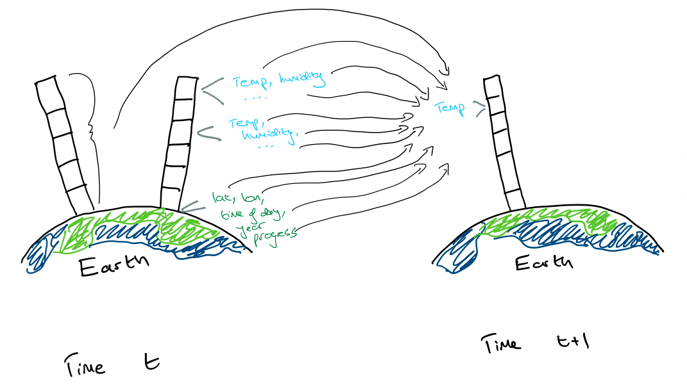
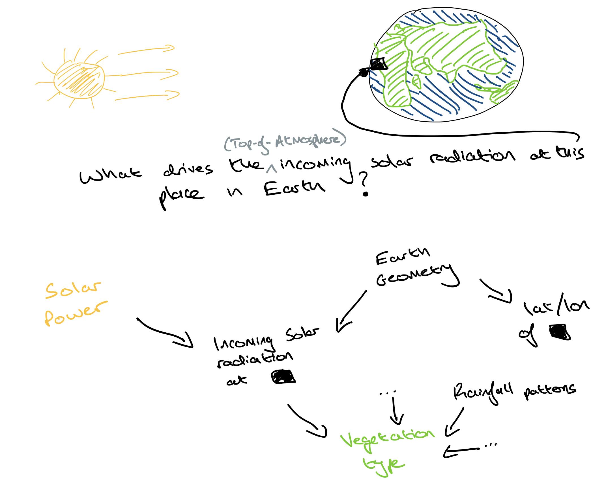

<!-- 
Retort for why we don't need causality for NWP: just retrain every year or so. That way the model is most upto date with the current regime.

Pushback:
-training every year is expensive (especially as we scale up model size) and not feasible for many organisations
-even if you do train every year, you only have small amount of data (the most recent data) that is most similar to the current weather regime you'll be predicting for. Given that we believe the laws of physics are not changing, let's just try and learn these (by using a causal model), instead of hoping to learn useful correlations
-if you want to use these types of models for experiments - e.g. sensitivity analysis, then you need to have a causal model!
 -->

I want to describe some of the key challenges to overcome if we are to use causal ML to forecast the weather. These challenges also apply more broadly to the ML forecasting of dynamical systems, but I will focus on the weather as it is an application area which I'm interested in (I work on this) and one where there is a lot of ML progress being made at the moment. All the work so far has been using standard correlation-learning ML. In [ML NWP]() I highlight what I believe are the key developments, as well as my suggestions to make further progress, but it isn't required reading for this piece.

The specific flavour of causal inference which we consider here is that of "invariant predictors". I describe this in [causality and invariance]() but, again, it isn't required to read that first. You just need to know that this is one of the popular approaches to causal inference. 

## Challenge 1: big data ##

A lot of nice methods from the causality literature do not scale well for the weather forecasting task. Here, "big" refers to the size of the states we are predicting, not to the number of training samples in our dataset. In the GraphCast <a href="https://www.science.org/doi/10.1126/science.adi2336" target="_blank" rel="noopener noreferrer">(Lam et al., 2023)</a> ML model for Numerical Weather Prediction (NWP), the state of the atmosphere is predicted at each time-step based on the two previous time-steps. The size of the target state is huge: there are $235,680,480$ values to predict. And a ML function must be learnt to map between the $471,360,960$ values in the previous two states and the $235,680,480$ values in the target state. 

If we were to take the invariance approaches in <a href="https://arxiv.org/abs/1501.01332" target="_blank" rel="noopener noreferrer">Peters et al., 2015</a> and <a href="https://arxiv.org/abs/1706.08576" target="_blank" rel="noopener noreferrer">Heinze-Deml et al.</a>, we would need to fit at least $2^{471,360,960} \times 235,680,480$ separate models to carry out their required procedures. Briefly, these procedures involve fitting models for all possible "parents" (the variables which cause the target) of the target variables, and only keeping those models which obey a certain "invariance" property. Again, see [this]() for more information.

The number $2^{471,360,960} \times 235,680,480$ arises as there are $2^{471,360,960}$ different subsets of the input variables to consider as potential parents of the target variables, and there are $235,680,480$ different targets we would need to do the procedure for. This is not feasible. Granted, we could use physical knowledge to restrict the subsets of input variables we would need to consider, but this would still likely result in a computationally intractable procedure. Similar constraints limit the ability to use other types of causal methods such as PCMCI (<a href="https://www.science.org/doi/10.1126/sciadv.aau4996" target="_blank" rel="noopener noreferrer">Runge et al., 2019</a>), a popular approach for earth systems.  

## Challenge 2: unobserved variables ##

We don't have data on the full atmospheric state, since the training data for ML NWP comes at a specific resolution (if reanalysis products are used), or are sparse (if observations are used). Data for finer spatio-temporal resolutions is therefore unobserved. This is an issue because we know that small-scale processes can have sizeable impacts on larger-scale weather. The "parameterization" body of work in atmospheric physics is about working out how to best represent the effects of these unobserved processes. Parameterizations are responsible for large uncertainties in forecasts &mdash; these unobserved processes matter, and they are hard to model correctly!

Therefore, when learning to predict the temperature in a particular grid cell, at a particular vertical level, at the next time-step, some of the causal drivers of that variable may be unobserved. We might not have data on them. Having unobserved variables in a system can result in spurious correlations (i.e. the wrong functional relationships) being learnt when a model is only fitted to observed data. 

Unfortunately, most of the approaches which tackle big data do not deal with unobserved variables, and vice-versa. 
<!-- The Invariant Risk Minimization (Arjovsky et al., ) approach is a nice procedure which extends the invariance idea in causality to deep learning cases, but it loses the ability to deal with unobserved variables [check this]. Need to check this. Probably will check this when i write the article on it -->

## Challenge 3: separating data into environments 

A key part of the invariance approach to causality is being able to split training data into distinct "environments" (e.g. different times, different regions, different experimental settings etc.). Typically, the environment should only affect (either directly or indirectly) the input variables, $X$. The environment should not directly cause the targets, $Y$, and $Y$ should not cause the environment. 

An example given by <a href="https://arxiv.org/abs/1706.08576" target="_blank" rel="noopener noreferrer">Heinze-Deml et al.</a> for such a set-up is the task of modelling the total fertility rate, $Y$, in a country. There are many theories for what drives changes in fertility. One argues that economic growth is responsible for declines in fertility; and another argues that it is the transmission of new ideas which drives declines. Therefore, let's assume that the causal drivers exist in the following set of $X$ variables: IMR (infant mortality rate), GDP variables (e.g. GDP per capita, GDP per capita growth) and Education. A potential environmental variable is continent of the country. If it is to be an environmental variable, we assume that it is not affected by the fertility rate (which is reasonable &mdash; changing the fertility rate in a country would not change its continent). And that the fertility rate is not directly affected by the continent &mdash; continent only *indirectly* affects it through mediating variables such as GDP. Given this, here are two potential compatible graphs, or causal explanations, of the system:

<figure>
    
    <figcaption>
    Fig. 1: Potential causal graphs. (Image source: Figure 1 in 
    <a href="https://arxiv.org/abs/1706.08576" target="_blank" rel="noopener noreferrer">
        Heinze-Deml et al., 2018</a>)
    </figcaption>
</figure>

<!-- For example, if I were trying to understand what affects student grades, $Y$, and I assumed that all the causes existed within this set of $X$ variables: {time in library, natural talent, class size, teacher rating}, then an environmental variable could be proximity to library. This does not directly affect student grades, $Y, but only indirectly through its affect on "time in library". This is depicted in the below Figure: -->

When forecasting weather, it is not obvious how we should separate data into environments. To talk through this, I've sketched a simplified graphical model for GraphCast's prediction of the temperature, $Y$, at time $t+1$ in a particular grid cell, at a particular vertical level, given $X$, the states in all cells, at all vertical levels at time $t$. Note that GraphCast also uses information from time $t-1$ but I've omitted that in the sketch for clarity.

<figure>
    
    <figcaption>
    Fig. 2: GraphCast sketch. The temperature in a particular grid cell, at a particular vertical level at time $t+1$ is predicted based on information on various features (e.g. temperature, humidity) from all grid cells, at all vertical levels, as well as static features such as latitude and longitude, at time $t$. I've only drawn two vertical columns at time $t$ for clarity. 
    </figcaption>
</figure>

### Separating by space ###

An environmental variable cannot be a cause of $Y$. This rules out using space/location as an environment, since latitude and longitude are used as inputs (they are part of $X$ i.e. treated as potential causes of $Y$). 

One way to deal with this would be to stop using lat/lon as input features, and make them an environmental variable. In doing this, we may argue that lat/lon does not "cause" $Y$, and that the function which maps $X$ to $Y$ should not depend on lat/lon anyway since the laws of meteorology are not functions of lat/lon. But if DeepMind included lat/lon in the first place, I suspect it is a useful input feature. This must be because, in the training data, it is correlated with an actual cause for $Y$ which is *unobserved*. An example of an unobserved cause may be vegetation cover and this is indeed used in the ECMWF's Integrated Forecasting Model (their physics-based one). Vegetation is correlated to latitude since tropical regions (near the equator) often have dense vegetation. Also, lat/lon, when combined with time-of-the-year, is indicative of the solar radiation incoming on Earth, another important driver for weather. This is illustrated in the graphical diagram in Figure 3:

<figure>
    
    <figcaption>
    Fig. 3: What drives the total incoming top-of-atmosphere solar radiation in the black grid cell? What are the causal drivers versus what are simply correlated with them?
    </figcaption>
</figure>

Here's a brief description of how vegetation type, incoming solar radiation and lat/lon are linked. The Earth's geometry is causal for how much solar radiation per square surface area reaches the Earth. Areas closer to the equator receive more. Lat/lon is derived by us from the Earth's geometry and so it is correlated with the total incoming solar radiation. This seems a pretty robust correlation, given that we don't expect the Earth's geometry to change anytime soon. 

The incoming solar radiation affects vegetation too since different plants require different amounts of it. Therefore, vegetation is also correlated with lat/lon. The issue is that learning this type of correlation may not be robust to alternative environments, such as scenarios where humans remove large quantities of vegetation. With a physics-based model like the IFS, we could deal with this by just updating the vegetation type assigned to each grid box, but an ML model which uses lat/lon as a proxy for vegetation would not be able to adapt. 

Therefore, treating lat/lon as an input feature may improve predictive accuracy in the training set (and for the hold-out sets considered in GraphCast). But in environments sufficiently different to the training set, inclusion of lat/lon may result in a non-robust predictor if its correlation with unobserved causes of $Y$ changes. On the other hand, treating lat/lon as an environment variable may result in a more robust predictor overall, but it may perform worse for environments similar to the training dataset (where including spurious correlations are not harmful). In conclusion, there is a compromise between predictive accuracy and robustness depending on what we do with the lat/lon feature and depending on what hold-out sets we use for assessment.

### Separating by time ###

How about using time as an environment? In GraphCast, "local time of day" and "elapsed year progress" are both used as input features ($X$), so we can't use them as environment variables. But we could use the actual year as an environment. In doing this we would be assuming that i) $Y$ does not cause the year, which makes sense, and ii) that the year does not directly cause $Y$. In other words, conditioned on $X$, $Y$ is independent of the year. 

We expect different environments to either directly or indirectly affect $X$. The reason we may think of the year as being able to affect $X$, is that the year is correlated to anthropogenic emissions. If we believe that different emissions will somehow impact the weather state $X$, then year may be a suitable environment. Intuitively, in doing this, we are saying that we don't want our forecasts to perform better or worse simply due to the calendar year. But we have to take care given that the correlation between year and anthropogenic emissions will probably change over time! It would be better to directly use anthropogenic emissions as the environment instead. 

Things gets even trickier when we note that there will be hidden variables at play. We then need to find an environment variable which also does not affect the hidden variables...

We need to devise ways to come up with appropriate environmental variables (to help us learn causal models), without removing variables from the existing input feature set in state-of-the-art ML NWP (in order to still make accurate predictions). 

## Looking ahead

Damon, Omer and I have been putting a research proposal together (to EPSRC) to tackle the above. Hopefully, there will be more to share in the near future!
