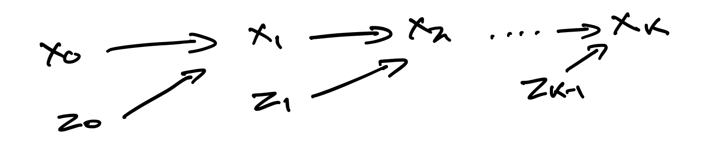

This page is about score-based generative modelling: why we would want to do it, and a simple way to do it. This is background to the more sophisticated diffusion models used in practice today. 

There are many tutorials and blog posts on diffusion already, such as <a href="https://lilianweng.github.io/posts/2021-07-11-diffusion-models/" target="_blank" rel="noopener noreferrer">Lilian Weng's</a> . My favourite is <a href="https://yang-song.net/blog/2021/score/" target="_blank" rel="noopener noreferrer">Yang Song's</a> which I found excellent and refer you to. I largely follow his structure and refer to the same equations here. So what's new with this? I wrote this with a *slightly* different presentation which I found helpful when first reading about diffusion, and wanted to note it down for myself. 

Given a dataset $\\{\mathbf{x}\_1,\mathbf{x}\_2,...,\mathbf{x}\_N\\}$, where each $\mathbf{x}\_i \in \mathbb{R}^d$ is a vector which comes from an underlying distribution $p_\mathrm{data}(\mathbf{x})$, our goal is to learn a model which can be used to generate data from something as close as possible to $p_\mathrm{data}(\mathbf{x})$. 

A common thing to do in probabilistic modelling is to use a known distribution and learn its parameters from data. For example, we could use a multivariate normal distribution and propose the model, $\mathbf{X} \sim MVN(\boldsymbol{\mu}, \sigma \mathbf{I})$, where

$$
\begin{equation}
p_\theta(\mathbf{x}) = \frac{1}{\left(\sigma \sqrt{2\pi}\right)^{d}} \exp\left(-\frac{1}{2 \sigma^2}\left \\| \mathbf{x} - \boldsymbol{\mu} \right \\|^2 \right)
\end{equation}
$$

which has unknown parameters $\theta = \[\boldsymbol{\mu}, \sigma \]$. We may then learn the parameters of this distribution by minimizing a particular divergence between $p_\theta(\mathbf{x})$ and $p_\mathrm{data}(\mathbf{x})$. 

But *what if we want to learn the distribution itself, instead of just the parameters of an off-the-shelf distribution*. How do we specify $p_\theta(\mathbf{x})$ such that it can be learned with machine learning, and what divergence should we minimize to learn $\theta$? 

## Fitting our models ##

A classic way to fit models to data is to minimize the KL-divergence between our model and the data with respect to the learnable parameters, $\theta$. Below, we will see how one formulation of this is intractable for non-standard probability density functions (p.d.f.), and another formulation requires sampling from our model, which can be costly to do for non-standard p.d.f.s. We will then see that minimizing the Fisher divergence instead of the KL provides a alternative path. 

### Minimizing KL divergence / maximizing likelihood ###

Minimizing the KL-divergence between our model and the data with respect to $\theta$

$$
\begin{equation}
\mathrm{min}_\theta D\_{KL} \left[p\_\mathrm{data}(\mathbf{x}) \\, \\| \\, p\_\theta(\mathbf{x})\right],
\end{equation}
$$

can be shown to be equivalent to maximizing the log-likelihood over the data with respect to $\theta$

$$
\begin{equation}
\mathrm{max}_\theta  \sum\_{i=1}^{N}  \operatorname{log}p\_\mathrm{\theta}(\mathbf{x\_i}).
\end{equation}
$$

However, computing the likelihood is only doable for certain probability models. For example, the model $\mathbf{X} \sim MVN(\boldsymbol{\mu}, \sigma \mathbf{I})$ has the simple likelihood function shown in equation 1 so maximum likelihood training is easy. We could also pick other models based on known parametric distributions, and go and learn their parameters. 

But for more sophisticated data (e.g. photos of animals), off-the-shelf distributions are not sufficient and we want more sophisticated distributions. Instead of learning the parameters of a distribution, we can learn the p.d.f. directly. Now, it would be tricky to represent $p_\mathrm{\theta}(\mathbf{x})$ directly with a neural network since we would need to ensure $\int p_\mathrm{\theta}(\mathbf{x}) d\mathbf{x} = 1$. It is not obvious how to specify a neural network function which always integrates to $1$ regardless of the parameters. 

We can instead define a p.d.f. 

$$
\begin{equation}
p_\mathrm{\theta}(\mathbf{x}) = \frac{\exp\left(-E_\mathrm{\theta}\left(\mathbf{x}\right) \right)}{Z_\theta},
\end{equation}
$$

where $E_\mathrm{\theta}(\mathbf{x}) \in \mathbb{R}$ is an arbitrary function parameterized by $\theta$, which we can learn with a neural network. We still require $\int p_\mathrm{\theta}(\mathbf{x}) d\mathbf{x} = 1$, which means we need a normalizing constant $Z_\theta = \int \exp(-E_\mathrm{\theta}(\mathbf{x})) d\mathbf{x}$ to satisfy this. However, we will see later on that this is not too big of an obstacle. Importantly, we are free to use a neural network to learn $E_\mathrm{\theta}(\mathbf{x})$, as this is supposed to represent the unnormalized negative log-p.d.f. of the data distribution. It needn't integrate to $1$.

 <!-- Instead, we get around this by using the form in equation 5, and learning $E_\mathrm{\theta}(\mathbf{x})$, which is the unnormalized negative log-p.d.f. We are free to represent this with a neural network as it does not have similar restrictions.   -->

<!-- Consider again the flexibility of this. Imagine the `true' p.d.f of the data is $p_\mathrm{truth}(\mathbf{x})$. Learning this directly would be tricky with neural networks as we would need to restrict ourselves to functions that are only positive, and integrate to one. Instead, we can learn the unnormalized negative log-p.d.f instead, $E_\mathrm{\theta}(\mathbf{x})$.  -->

#### Calculating the likelihood is not possible #### 

One problem with equation 4 is that for sophisticated $E$ functions, it is intractable to do $\int \exp(-E_\mathrm{\theta}(\mathbf{x})) d\mathbf{x}$ to find $Z_\theta$, which means we cannot calculate the likelihood. Therefore, we cannot proceed with maximum likelihood training via this route. 

<!-- In order to make maximum likelihood training possible, we must restrict ourselves to p.d.fs where we know or can calculate the normalization constant, or to cases where we can approximate the p.d.f (such as is done with VAEs). -->

#### Maximum likelihood training is still possible, but requires sampling from the model ####

Although we can't calculate the likelihood, we can estimate its gradient with respect to the parameters, and just use this in gradient descent. The gradient of the log-likelihood with respect to the parameters is

$$
\begin{equation}
\nabla_\mathrm{\theta}\operatorname{log} p_\theta(\mathbf{x}) = -\nabla_\mathrm{\theta} E_\theta(\mathbf{x}) - \nabla_\mathrm{\theta}\operatorname{log} Z_\theta
\end{equation}
$$

which follows from equation 4. And although we cannot compute $\nabla_\mathrm{\theta}\operatorname{log} Z_\theta$ exactly, since we do not know $Z_\theta$, it can be shown (a derivation is in  <a href="https://arxiv.org/abs/2101.03288" target="_blank" rel="noopener noreferrer">Song and Kingma, 2021</a>) that

$$
\begin{equation}
-\nabla_\mathrm{\theta}\operatorname{log} Z\_\theta = \mathbb{E}_{\mathbf{x} \sim p\_\theta(\mathbf{x})} [-\nabla\_{\theta} E\_\theta(\mathbf{x})].
\end{equation}
$$

Therefore, one can estimate the gradient of the log-likelihood by plugging in equation 6 into equation 5, and using Monte-Carlo sampling to approximate the expectation

$$
\begin{equation}
\nabla_\mathrm{\theta}\operatorname{log} p\_\theta(\mathbf{x}) \approx  -\nabla_\mathrm{\theta} E\_\theta(\mathbf{x}) -\nabla_\mathrm{\theta} E\_\theta(\mathbf{\tilde{x}}),
\end{equation}
$$
where $\mathbf{\tilde{x}} \sim p_\theta(\mathbf{x})$. Unfortunately, this process requires sampling from $p_\theta(\mathbf{x})$ which is not trivial. The methods required to do this (e.g. Langevin sampling, discussed [below](#sampling-from-our-model)) require many iterations, making this inefficient for training.

### Minimizing Fisher divergence ###

An alternative approach is to minimize an alternative divergence which doesn't require calculating any normalization constants or requiring approximations to get around them. One such divergence is the **Fisher divergence**:

$$
\begin{equation}
\mathrm{min}_\theta  D\_{f} [p\_\mathrm{data}(\mathbf{x}) \\, \\| \\, p\_\theta(\mathbf{x})] = \mathbb{E}\_{\mathbf{x} \sim p\_\mathrm{data}(\mathbf{x})} \left[ \\| \nabla\_{\mathbf{x}} \operatorname{log}p\_\mathrm{data} (\mathbf{x}) - \nabla\_{\mathbf{x}} \operatorname{log}p\_\theta(\mathbf{x}) \\|\_{2}^2 \right]
\end{equation}
$$

The **score function** of $p(\mathbf{x})$ is defined as

$$
\begin{equation}
\nabla_{\mathbf{x}} \operatorname{log}p(\mathbf{x}),
\end{equation}
$$

and we can parameterize it with a model. It is often written as $\mathbf{s}_\theta (\mathbf{x})$. Note that we are taking the derivative with respect to $\mathbf{x}$ here, unlike in equation 5, where it was with respect to $\theta$.
<!-- No longer is there a condition on this function regarding what it integrates to. We are freer in our choice of functions, and therefore models.  -->

Based on equation 4, we see that $\mathbf{s}_\theta (\mathbf{x})$ is independent of the normalization constant:

$$
\begin{equation}
\mathbf{s}_\theta (\mathbf{x}) = \nabla\_{\mathbf{x}} \operatorname{log}p\_\theta(\mathbf{x}) = -\nabla\_{\mathbf{x}}  E\_\theta (\mathbf{x})    -\nabla\_{\mathbf{x}} \operatorname{log} Z\_\theta  = -\nabla\_{\mathbf{x}}  E\_\theta (\mathbf{x}),
\end{equation}
$$

where the final equality follows because $Z_\theta$ is not a function of $\mathbf{x}$. 

There's yet another obstacle though: we cannot directly compute the Fisher divergence based on equation 8 as it depends on knowing $ \operatorname{log}p\_\mathrm{data} (\mathbf{x})$. Fortunately, <a href="https://jmlr.org/papers/volume6/hyvarinen05a/hyvarinen05a.pdf" target="_blank" rel="noopener noreferrer">Hyvarinen, 2005</a> showed that integration by parts yields a form which does not require knowing this term. Using this, we get the Fisher divergence as

$$
\begin{equation}
\mathbb{E}\_{\mathbf{x} \sim p\_\mathrm{data}(\mathbf{x})} \left[ \operatorname{tr}(\nabla_{\mathbf{x}}^2 \operatorname{log}p\_\theta(\mathbf{x})) + \frac{1}{2} \\| \nabla\_{\mathbf{x}} \operatorname{log}p\_\theta(\mathbf{x}) \\| \_{2}^2 \right] + \textrm{constant}
\end{equation}
$$

and we can go ahead and optimize this using gradient descent!

We now have a way to train a more flexible type of probability model.

<!-- Here is some code for a simple 1D case.  -->

## Sampling from our model ##

After having trained the model, we can now sample from it. Langevin dynamics is one way to do this. In order to sample $\mathbf{x}$ from a distribution $p(\mathbf{x})$, you initialize $\mathbf{x}_0$ from a prior distribution such as $N(0,I)$, and then iterate

$$
\begin{equation}
\mathbf{x}_{i+1} \leftarrow \mathbf{x}\_{i} + \epsilon \nabla\_{\mathbf{x}} \operatorname{log}p(\mathbf{x}_i) + \sqrt{2\epsilon} \mathbf{z}_i, \quad i = 0,1, \ldots, K,
\end{equation}
$$

where $\mathbf{z}_i \sim N(0,I)$. As $\epsilon \rightarrow 0$ and $K \rightarrow \infty$, the sample $\mathbf{x}_K$ converges to a sample from $p(\mathbf{x})$. 

Intuitively, we are using $\nabla\_{\mathbf{x}} \operatorname{log}p(\mathbf{x}\_i)$ to adjust the current $\mathbf{x}\_{i}$ to something which is more likely to be generated by $p(\mathbf{x})$ i.e. we take steps towards values of $\mathbf{x}$ which are assigned greater probability density by $p(\mathbf{x})$. However, we don't want to just end up outputting the mode of the distribution, for example. We want to generate samples, so we include some random noise with $\mathbf{z}_i$ to encourage some diversity. 

<a href="https://yang-song.net/blog/2021/score/" target="_blank" rel="noopener noreferrer">Yang Song</a> has some nice graphics which show the score function, and the sampling process. I'd recommend taking a look at them for further intuition. 

We can now draw the graphical model, showing how we generate samples:

<figure>
    
    <figcaption>
    Fig. 1: Graphical model. This corresponds to the sampling strategy in equation 12.
    </figcaption>
</figure>

## Why I found the score-based perspective more intuitive ##

<!-- We've got the basics of a diffusion model here. There are many things that need to be adjusted but this sets the foundations.  -->

I found the score-based perspective of diffusion models more intuitive than the alternative ELBO-based perspective, which is why I wrote things this way. The reason is that whilst first writing the graphical model down and then training the model made sense to me for something like a VAE or GAN, it wasn't as obvious to me for diffusion models. With a VAE which generates images of handwritten digits, I could imagine thinking `I'll model these images as being generated by first specifying key characteristics about them (like the number, style, boldness etc.), which I'll use a latent variable to represent, and then generate the image of the digit from that'. 

But it was not as obvious to me to think `I'll model these images as being generated by first taking random noise, and making minor adjustments to it many, many times, until it looks like a handwritten digit'. I imagine this is far more intuitive to those with a stochastic physics background though.

The idea of specifying the p.d.f directly, and minimizing an appropriate divergence to learn the p.d.f, was easier to follow when I first learnt about this. The many steps required to generate samples is simply a result of using a sampling strategy that allows us to sample from our arbitrary p.d.f..

<!-- 
## More on the Fisher divergence ##

Link to KL divergence gradient.  -->

