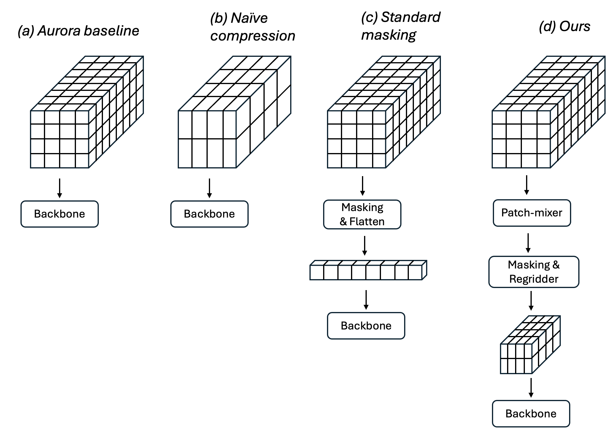
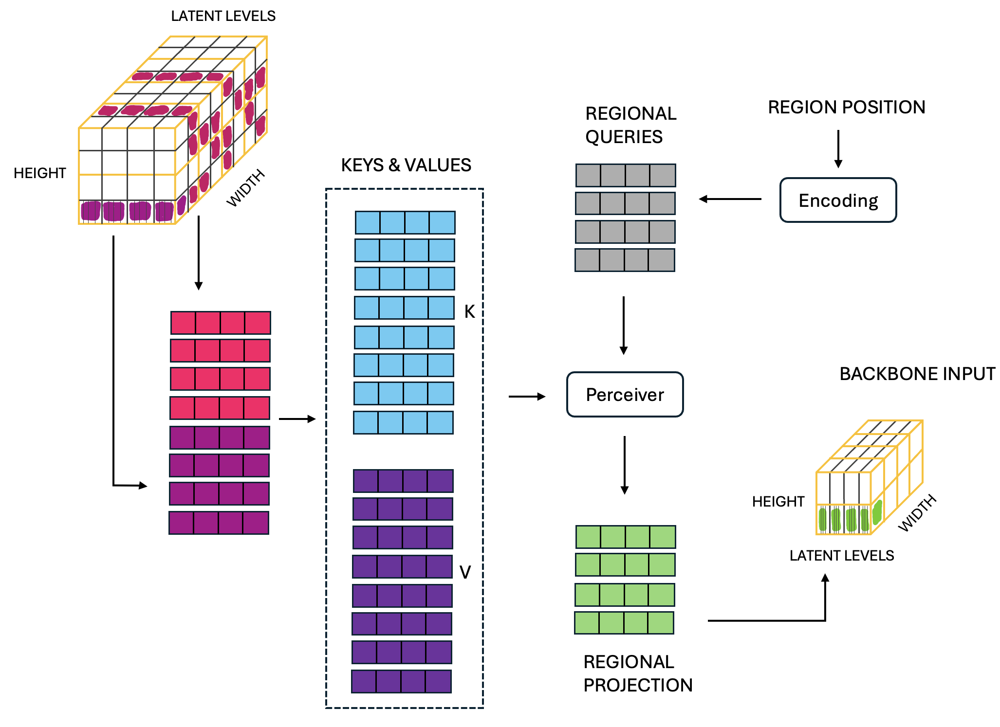
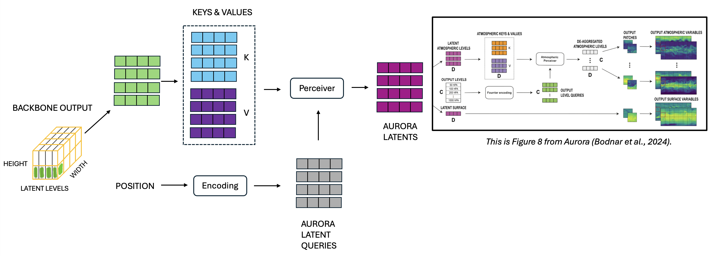

The promise of diffusion transformers for weather is limited by how they typically require far more resources to train than non-generative models. With a push to higher-resolution data and handling of multimodalities such as diverse observations, transformers must process even more data. This increases their computational cost which typically scales quadratically with the number of data patches processed. A current solution for improving training efficiency involves randomly masking patches during training to reduce the number of patches processed. However, it remains unclear how to process the remaining patches with backbone architectures that are well-suited for weather such as 3D U-Net Swin Transformers. I propose an attention-based regridder that regrids selected patches onto a fixed-dimensional latent grid, enabling efficient subsequent processing by these popular backbones. 

## Introduction ##

How can we train ML models for weather forecasting and downstream tasks more efficiently? Diffusion models are promising but are particularly expensive to train. Following on from successes in the image domain, diffusion models have shown strong results in weather  &mdash; GenCast's <a href="https://arxiv.org/abs/2312.15796" target="_blank" rel="noopener noreferrer">[Price et al., 2023] </a> diffusion-based forecasts outperform  ECMWF's ensemble forecast (ENS) on 97% of evaluated variables in terms of CRPS scores. However, diffusion models often require significantly more training iterations (e.g. 2 million for GenCast) compared to their non-generative counterparts (300,000 for GraphCast <a href="https://arxiv.org/abs/2212.12794" target="_blank" rel="noopener noreferrer">[Lam et al., 2023] </a>). The cost (in both resources and time) to train these models will only further increase with a move to higher-resolution models and multimodal models, which typically demand more FLOPs per training iteration. This makes large-scale diffusion training prohibitive. I will present a proposal to alleviate this in the weather domain, aiming to make diffusion training more accessible while enabling the training of larger models on bigger data.

 <!-- In doing so, we would hopefully not only make diffusion training (both from scratch and fine-tuning) more accessible, but would aid training larger models on bigger data.  -->

We will consider vision transformer-based diffusion models <a href="https://arxiv.org/abs/2010.11929" target="_blank" rel="noopener noreferrer">[Dosovitskiy et al., 2021 </a> , <a href="https://arxiv.org/abs/2212.09748" target="_blank" rel="noopener noreferrer">Peebles & Xie, 2023] </a>, such as GenCast. A major computational cost in transformers arises from the number of patches/tokens that must be processed given that self-attention complexity scales quadratic with this number. While transformers are flexible enough to handle various types of data, higher-resolution and multimodal data typically require processing more patches, increasing the training cost. Our goal is to reduce the number of patches that need processing to lower the training cost.

We build on <a href="https://arxiv.org/pdf/2407.15811" target="_blank" rel="noopener noreferrer">Sehwag et al.'s </a> approach  to randomly eliminate (mask) a fraction of patches, process the remaining ones with a transformer, and only use the *unmasked* patches as targets. For weather forecasting, this approach corresponds to modelling variables at randomly selected locations based only on information from past time-steps at those locations. Sehwag et al.'s specific contribution is to use a lightweight patch-mixer before patch masking, allowing a far higher fraction of patches to be dropped since non-masked patches now retain more information about the whole image. Using this, they were able to train competitive image diffusion models at 14x lower cost than the current state-of-the-art approach. 

This proposal's specific contribution is to make the efficiency-by-patch-masking approach better suited for the weather domain. Sehwag et al.'s method of flattening unmasked patches into a 1D sequence and processing them with a transformer is limited for weather for two reasons. First, it is unclear how to use efficient forms of attention like shifted window attention. The state-space of weather data is so large that full self-attention often cannot be used, meaning efficient variants like shifted window attention (e.g. Swin Transformers <a href="https://arxiv.org/abs/2103.14030" target="_blank" rel="noopener noreferrer">[Liu et al., 2021]</a>) and local attention (e.g. in GenCast) are crucial. If we have a large initial number of patches, then even with a large masking fraction we may still require windowed attention. However, it is unclear how to apply this to a random selection of patches. For example, given a selection of patches in 3D space (i.e. with a 3D positional encoding of latitude, longitude, height), which patches should belong in the same 'window'? 

<!-- Note that the unmasked patches are randomly chosen so will be changing at each training iteration too.  -->

Second, whilst models based on 3D U-Net style encoder-decoder architectures are popular [e.g. <a href="https://www.nature.com/articles/s41586-023-06185-3" target="_blank" rel="noopener noreferrer">Bi et al., 2023 </a> , <a href="https://arxiv.org/abs/2405.13063" target="_blank" rel="noopener noreferrer">Bodnar et al., 2024 </a>, <a href="https://www.arxiv.org/pdf/2408.05472" target="_blank" rel="noopener noreferrer">Sun et al., 2024] </a> for their ability to model relationships at  multiple scales, it is not clear how downsampling and upsampling operations would work with randomly selected patches in 3D space. 

To address these issues, I propose using Perceiver-style <a href="https://arxiv.org/abs/2107.14795" target="_blank" rel="noopener noreferrer">[Jaegle et al., 2021]</a> cross-attention to 'regrid' the unmasked patches onto a fixed-dimensional latent grid. This allows windowed attention and 3D U-Net style architectures to then be used, whilst processing only a fraction of the original patches. After pre-training, the regridding process is bypassed and fine-tuning is done without patch masking.

<!-- The specific proposition would be to i) augment the masking training procedure to allow it to generate arbitrary numbers of tokens, and maximize the number of tokens that can be dropped during training whilst still learning something and ii) use the Perceiver to convert this varying-length masked output into a fixed size state which can be processed by a specific backbone, such as a 3D U-net style transformer.  -->

## Background ##

### Diffusion models ###

Diffusion models can be viewed from several perspectives, including variational inference <a href="https://arxiv.org/abs/2006.11239" target="_blank" rel="noopener noreferrer">[Ho et al., 2020 </a> , <a href="https://arxiv.org/pdf/1503.03585" target="_blank" rel="noopener noreferrer">Sohl-Dickstein et al., 2015] </a>, score-matching <a href="https://arxiv.org/abs/1907.05600" target="_blank" rel="noopener noreferrer">[Song & Ermon, 2020]</a> and stochastic differential equations <a href="https://arxiv.org/abs/2011.13456" target="_blank" rel="noopener noreferrer">[Song et al., 2021]</a>. For this proposal, the reader should know that diffusion models can be understood as learning to generate data by learning how to remove noise from noisy data. Given the target weather state, $\mathbf{x}_{t+1}$, and the previous weather state, $\mathbf{x}_t$, and a denoising function $F\_\theta \left(\mathbf{x}\_{t+1}; \sigma \left(t\right), \mathbf{x}\_t \right)$, the loss function is

$$
\begin{equation*}
\mathcal{L} = \mathbb{E}\_{(\mathbf{x}\_{t+1},\mathbf{x}\_{t}) \sim \mathcal{D}} \mathbb{E}\_{\mathbf{\epsilon} \sim N\left(\mathbf{0},\sigma(t)^2 \mathbf{I}\right)} \\| F_\theta \left(\mathbf{x}\_{t+1} + \mathbf{\epsilon}; \sigma\left(t\right), \mathbf{x}\_t\right) - \mathbf{x}\_{t+1}        \\|_2 ^2,
\end{equation*}
$$
where $\mathcal{D}$ is the data distribution. We may use neural networks to parameterize $F\_\theta$, training it to take a noisy version of the next atmospheric state, the standard deviation of the noise which has been added to create this noisy version, and the current atmospheric state, and then output the denoised next state. 

### Patch masking for training transformers ###

Patch masking is a self-supervised learning technique that helps models learn good representations and be adaptable to different tasks. It was first popularized in language models with BERT  <a href="https://arxiv.org/abs/1810.04805" target="_blank" rel="noopener noreferrer">[Devlin et al., 2019]</a>, extended to vision tasks <a href="https://arxiv.org/abs/2111.06377" target="_blank" rel="noopener noreferrer">[He et al., 2021]</a>, and recently applied to weather <a href="https://arxiv.org/abs/2308.13280" target="_blank" rel="noopener noreferrer">[Lessig et al., 2023]</a>. In these cases, the model is trained to predict masked tokens based on the unmasked ones.

Patch masking also offers training efficiency gains. Unlike BERT, which  processes both masked and unmasked tokens in its backbone, He et al. use the bulk of computation on only the unmasked tokens, resulting in 3x faster training due to reduced compute requirements. An alternative approach used by Sehwag et al. for diffusion transformers is to mask a subset of patches, and train to only predict the unmasked patches. The diffusion formulation means that noise is added to the unmasked patches which must be removed by the diffusion transformer. Their innovation was to use a patch-mixer before masking, allowing a far higher patch-dropping rate without performance loss.

To the best of my knowledge, existing patch masking methods process unmasked patches using standard transformer layers, after having flattened the unmasked patches into a 1D sequence. This proposal introduces an attention-based regridding approach, where unmasked patches are mapped onto a 3D grid to enable the use of 3D architectures for further processing.

### Demands for greater numbers of patches ###

As the size of the data input to a transformer-based model increases, typically so does the number of patches required to be processed. This is evident in weather modelling, where it is more expensive to train models of higher-resolution data. Additionally, the growing trend of incorporating multimodal data in weather models increases the number of patches needed. Each modality &mdash; whether it be satellite data, reanalysis datasets or surface observations &mdash; adds to the computational complexity, as they bring additional patches that need processing. 

Following the successes of machine learning (ML) for numerical weather prediction (NWP), there has been a push to use ML as an alternative to the traditional data assimilation step, which is still necessary to generate initial conditions for ML-for-NWP models. Benefits of this approach include the ability to process far more observational data than current data assimilation systems capture, and flexibly handling various different observational data sources. Transformers are known for handling multimodal data effectively. Typically, different modalities are converted into separate patches, which are then processed together by transformer layers. For example, in this manner the Perceiver <a href="https://arxiv.org/abs/2107.14795" target="_blank" rel="noopener noreferrer">[Jaegle et al., 2021]</a>  handles audio and video data, while  LLaVA <a href="https://arxiv.org/abs/2107.14795" target="_blank" rel="noopener noreferrer">[Liu et al., 2023]</a> and ViLBERT <a href="https://arxiv.org/pdf/1908.02265" target="_blank" rel="noopener noreferrer">[Lu et al., 2019]</a>  manage image and language data.

Work in multimodal fusion focuses on how attention should be distributed across modalities, and at what layers cross-modal attention should be used. For instance, the Perceiver applies attention across all modalities at every layer by concatenating multimodal signals at the input. In contrast, <a href="https://arxiv.org/pdf/2107.00135" target="_blank" rel="noopener noreferrer">Nagrani et al., 2022</a> propose "fusion bottlenecks", where cross-modal attention is applied only at specific layers and through selected units, improving efficiency.

In the weather domain, <a href="https://arxiv.org/pdf/2407.15586" target="_blank" rel="noopener noreferrer">McNally et al., 2024 </a> process satellite observations together, whilst FuXi Weather <a href="https://www.arxiv.org/pdf/2408.05472" target="_blank" rel="noopener noreferrer">[Sun et al., 2024] </a> processes satellite data together with background forecasts. As more observational data is introduced in these models &mdash; such as surface observations from weather stations and marine data from ships and buoys &mdash; the number of patches required to process will increase. Efficient architectures and training strategies will be essential to manage this growing complexity effectively. 

## Methods ##

We will build on existing weather models, focusing on improving their efficiency. For ease of presentation, I will focus on tasks with a fixed-dimensional input and output state (these states may represent reanalysis weather state, a collection of observations, or a combination). Following GenCast <a href="https://arxiv.org/abs/2312.15796" target="_blank" rel="noopener noreferrer">[Price et al., 2023] </a>, we will concatenate conditioning information of the current state with the noisy target along the channel dimension. The model architecture will be adapted from Aurora <a href="https://arxiv.org/abs/2405.13063" target="_blank" rel="noopener noreferrer">[Bodnar et al., 2024]</a>, which, like many weather models, uses an encode-process-decode framework. Aurora uses Perceiver blocks <a href="https://arxiv.org/abs/2107.14795" target="_blank" rel="noopener noreferrer">[Jaegle et al., 2021]</a>  to embed weather states into a latent representation (shown in Figure 1a), compressing along the height dimension. This already reduces the number of patches to be processed by subsequent transformer layers. We will take Aurora's latent state as our starting point and further improve the efficiency of the backbone computation. The backbone is a 3D U-Net Swin Transformer <a href="https://arxiv.org/abs/2103.14030" target="_blank" rel="noopener noreferrer">[Liu et al., 2021]</a> and this composes the bulk of the computation.

### Existing approaches to reduce the number of patches ###

<figure>
    
    <figcaption style="font-weight: normal;">
    Fig. 1: <strong> Reducing number of patches to reduce computational cost. </strong> a) is the latent state output from the Aurora encoder, b) is a further compressed latent state (achieved through larger patch sizes or more aggressive compression via the Perceiver), and c) is a standard masking approach. While c) reduces training cost, it does not permit using architectures like 3D U-Net Swin Transformers, which are popular for weather modelling. To address this, we propose an attention-based regridder that projects unmasked patches onto a fixed latent state. 
    </figcaption>
</figure>

1. Using larger patch sizes (Figure 1b). Increasing patch size quadratically reduces the number of patches per weather state. However, larger patches can degrade performance due to more aggressive compression of larger regions into a single patches, as noted by <a href="https://arxiv.org/pdf/2407.15811" target="_blank" rel="noopener noreferrer">Sehwag et al. </a>.

2. Further compression via attention bottlenecks (Figure 1b). A smaller query size for the Perceiver allows more compression and fewer patches in the latent state. However, too much compression risks degrading performance. If greater compression could have been achieved without performance loss, the Aurora team would have likely done that!

3. Patch masking (Figure 1c). Dropping a large fraction of patches before processing them with transformer layers is a common approach. However, it is unclear how to process the remaining patches using 3D U-Net architectures or windowed self-attention.

Lastly, while reducing the number of parameters would also lower training costs, we wish to maintain model capacity, as larger models generally perform better on foundation-style tasks. 

### Proposed approach ###

**Patch-mixer before masking to retain information.** Following <a href="https://arxiv.org/pdf/2407.15811" target="_blank" rel="noopener noreferrer">Sehwag et al. </a>, I propose mixing patches prior to masking, so that non-masked patches retain information about the entire state. This approach allows for higher masking fractions compared to naive masking, increasing training efficiency. Without this mixer, dropping a large fraction of patches would leave significant gaps in the information available to the backbone. The token mixer can consist of a few transformer layers, such as Swin Transformer ones.

**Regridder after masking to pass the backbone a fixed-size input.** After masking, we use the Perceiver to regrid the remaining patches into a lower-dimensional  latent state with fixed dimensionality. A set of region-specific Perceivers attend to tokens within predefined regional zones. This is illustrated in Figure 2, where the latent state from Aurora's encoder is divided into different regions (yellow lines), and unmasked patches from each region are attended to using regional queries. The outputs compose the backbone's input, which can now be processed by the 3D U-Net Swin Transformer backbone. In this example, each patch has a dimension of 4, as in the Aurora paper.

<figure>
    
    <figcaption style="font-weight: normal;">
    Fig. 2: <strong> Masking and regridding. </strong> Starting from the Aurora encoder's latent state, patches are masked to maintain a specified number of patches per region. Regional queries attend to unmasked patches, with their output forming the 3D backbone's input.
    </figcaption>
</figure>

**Masking strategy.** To ensure that each region-specific Perceiver has patches to attend to, we mask a fixed percentage of patches from each region. For example, in Figure 2, 50% of patches are dropped from each region. In this set-up, patches are sampled as slices that span the full height levels, which allows for decoding with the Aurora decoder. However,  this is not a requirement of this method. 

**Using the Perceiver after processing to recover Aurora latent and decode.** After the backbone processes the data, the Perceiver is used to reconstruct patches in the Aurora latent state. These patches are then decoded using the Aurora decoder, as shown in Figure 3, to generate the final weather state for a given area on the globe across all height levels.

<figure>
    
    <figcaption style="font-weight: normal;">
    Fig. 3: <strong> Decoding to output state.</strong> Slices of patches from the backbone's output are attended to using queries with positional encodings based on the positions of the Aurora latent states. The resulting output is decoded using the Aurora decoder to produce weather states at all height levels, for a specific area of the globe. 
    </figcaption>
</figure>

**Training by dropping patches.** Assuming a binary mask $m$ for masking the Aurora latent state, and a binary mask $d(m)$ which represents what patches are masked in the decoded output state given a latent state with masking $m$, the loss function is

$$
\begin{equation*}
\begin{aligned}
\mathcal{L} = \mathbb{E}\_{(\mathbf{x}\_{t+1},\mathbf{x}\_{t}) \sim \mathcal{D}} \mathbb{E}\_{\mathbf{\epsilon} \sim N\left(\mathbf{0},\sigma(t)^2 \mathbf{I}\right)} \\| &F_\theta \left( M_\phi \left( \mathbf{x}\_{t+1} + \mathbf{\epsilon}; \sigma\left( t \right), \mathbf{x}\_t \right) \odot \left( 1-m \right); \sigma \left( t \right), \mathbf{x}\_t, m \right) \\\
 &- \mathbf{x}\_{t+1} \odot \left( 1 - d \left(m \right) \right)       \\|_2 ^2,
\end{aligned}
\end{equation*}
$$

where $M_\phi$ is the Aurora encoder followed by the patch-mixer, and $F_\theta$ is the backbone transformer followed by the decoding operations that produce the target weather state.

**Unmasked finetuning**. After pre-training, we drop the regridder and fine-tune on all patches, without masking. This allows the backbone to adapt to the increased number of patches. Sehwag et al. used this approach, and while GenCast did not did not use patch masking, the bulk of its training was done on $1 \degree$ data, before being fine-tuned on $0.25 \degree$ data. 

**Improving architecture with mixture-of-experts layers**. As in Sehwag et al., we may incorporate mixture-of-experts layers <a href="https://arxiv.org/abs/1701.06538" target="_blank" rel="noopener noreferrer">[Shazeer et al., 2017]</a> to increase the model's parameter count without significantly increasing the training cost. This helps scale model capacity whilst maintaining efficiency. 

## Hypotheses and ablations ##

Below are some ablation studies I would conduct to address potential queries related to this proposal.

First, one may ask: *"If the number of patches in the backbone input is determined solely by the sizes of the regional zones, why not skip masking and attend to all patches with the Perceiver when creating the backbone input?"*. 

I hypothesise that this should be avoided, as it would resemble the method of "further compression via attention bottlenecks", whose limitations were discussed earlier. To restate, a smaller, static backbone would be responsible for containing all the information necessary to generate the full output state. This is likely to fail because, if it were feasible, the Aurora team would have used a smaller latent state to begin with. Our approach, by contrast, gives the model a more manageable task: it only needs to generate the unmasked patches, and the backbone input adapts based on those unmasked patches. 

Second, one may ask: *"Why is the regridder necessary? Couldn't we just select one patch slice per regional zone and stack them together into a 3D latent representation?"*. 

While this might work if we only intend to use a single patch slice per regional zone, the regridder is required when selecting multiple patch slices per zone. The reason for this is that it better aligns the pre-training task with the target task. In the limit of choosing all patches per regional zone, we would revert to the scenario described in the previous paragraph. However, I believe there is a balance to be found between making the pre-training task more relevant to the final task, improving training efficiency, and ensuring that the pre-training task is feasible. 

